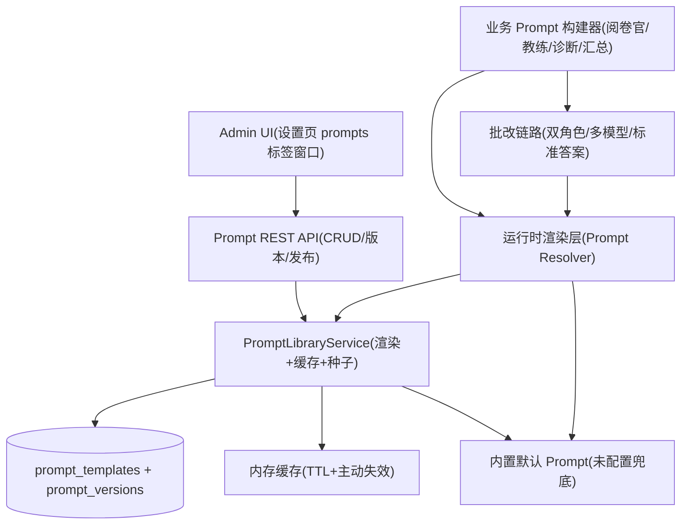

# Prompt 库（Prompt Library）技术方案

版本: V1.0
日期: 2026-08-13
适用范围: `backend/`（FastAPI + SQLAlchemy + Provider 抽象层）、`frontend/`（Next.js 15 + React 19 + TypeScript + Tailwind v4）
关联需求: 「Prompt 管理」——后台新增 Prompt Library，覆盖 概括题 Prompt、综合分析 Prompt、应用文 Prompt、作文 Prompt、Coach Prompt、Consensus Prompt 等模板，支持在线编辑与版本管理。

---

## 1. 背景与目标

### 1.1 现状分析

当前系统中所有 Prompt 均为**代码内硬编码**，散落在多个 Python 文件中：

| 位置 | 内容 | 说明 |
| --- | --- | --- |
| `backend/app/services/prompt_service.py:2` | `ESSAY_GRADING_MANUAL` | 《申论四大题型核心秘籍》知识库全文 |
| `backend/app/services/prompt_service_simple.py:79` | `create_expert_diagnosis_prompt` | 逐题诊断 Prompt（按题型动态生成维度 JSON） |
| `backend/app/services/prompt_service_simple.py:166` | `create_overall_evaluation_prompt` | 整体评价 Prompt |
| `backend/app/services/prompt_service_dual.py:36` | `build_grader_prompt` | 阅卷官 Prompt |
| `backend/app/services/prompt_service_dual.py:75` | `build_coach_prompt` | Coach（写作教练）Prompt |
| `backend/app/services/prompt_service_dual.py:116` | `build_standard_answer_prompt` | 标准答案 Prompt |
| `backend/app/services/ai_service.py:631` | 题型识别 Prompt | `get_question_type_from_ai` 内联 |
| `backend/app/services/grading/orchestrator.py:68` | 多模型汇总 | 当前为纯统计（均分/极值/标准差），无 AI Consensus |

由此带来的问题：

| 问题 | 具体表现 |
| --- | --- |
| 修改成本高 | 改一个 Prompt 需要改代码、改版本、重启服务，无法灰度验证 |
| 无版本管理 | 无法回溯历史版本、无法对比差异、无法快速回滚 |
| 无权限/操作隔离 | Prompt 与业务代码耦合，编辑风险高 |
| 无法按需切换 | 同一 Prompt 无法在多个版本间切换（如 A/B 验证不同评分口径） |
| Consensus 缺失 | 多模型汇总只有统计数字，缺少 AI 综合评语 |

### 1.2 改造目标

1. **Prompt Library（后台）**：在现有「设置」页面中新增 Prompt 管理窗口与 CRUD API，模板按分类组织，在线编辑。
2. **覆盖需求模板**：预置 概括题 / 综合分析 / 应用文 / 作文 / Coach / Consensus 等模板，并可扩展。
3. **版本管理**：不可变版本快照 + 版本号自增 + 草稿 / 发布 / 回滚 + 变更记录 + 版本对比。
4. **运行时接入**：批改链路改为「库优先、内置兜底」，未配置或未发布时行为与现状完全一致。
5. **Consensus Prompt**：新增多模型 AI 汇总能力（默认关闭，不影响现有接口）。

### 1.3 验收标准映射

| 验收标准 | 对应设计 |
| --- | --- |
| 后台可查看 Prompt 库并在线编辑 | 前端设置页「Prompt 库」标签窗口 + 编辑器（第 5 节） |
| 支持版本管理 | 版本快照模型 + 发布/回滚 + 差异对比（第 3.3、4.4 节） |
| 覆盖需求所列模板 | 种子模板清单（第 3.2 节） |
| 在线编辑后运行时立即生效 | 渲染层「库优先、内置兜底」+ 缓存失效（第 4.3、4.5 节） |
| 不破坏现有批改行为 | 未发布模板时回退内置 Prompt（第 4.3 节）+ 回归测试（第 8 节） |

---

## 2. 总体架构

### 2.1 架构图



### 2.2 设计原则

1. **库优先、内置兜底**：运行时优先读取已发布的库模板；库为空/未发布/模板停用时回退到内置常量，保证现有链路零行为变化。
2. **版本不可变**：每次保存生成新的版本快照，历史版本只读，可随时发布任意旧版本实现「回滚」，天然保留审计轨迹。
3. **占位符隔离**：模板内容使用 `{{变量}}` 占位符，与 Prompt 中大量存在的 JSON 大括号 `{}` 不冲突，避免转义地狱。
4. **单一事实来源**：内置默认 Prompt 收拢到 `prompt_defaults.py`，种子数据与运行时兜底共用同一份常量，杜绝两份内容漂移。
5. **动态部分保留在代码**：诊断类 Prompt 中由题型驱动的维度 JSON / 方法论描述等动态块仍由代码生成，模板只承载"可编辑的壳"。

---

## 3. Prompt 库设计（核心）

### 3.1 数据模型

**表 `prompt_templates`（模板主表）**

| 列 | 类型 | 约束 | 说明 |
| --- | --- | --- | --- |
| `id` | String | PK | UUID |
| `key` | String(100) | UNIQUE, NOT NULL | 机器标识，如 `coach_prompt`、`diagnosis_summary` |
| `name` | String(100) | NOT NULL | 显示名，如 "Coach Prompt" |
| `category` | String(50) | NOT NULL, INDEX | 分类：`detection` / `diagnosis` / `evaluation` / `grader` / `coach` / `standard_answer` / `consensus` / `knowledge` |
| `description` | Text | NULL | 用途说明 |
| `is_active` | Boolean | NOT NULL, DEFAULT TRUE | 停用后运行时忽略该模板 |
| `created_at` | DateTime | NOT NULL | |
| `updated_at` | DateTime | NOT NULL | |

**表 `prompt_versions`（版本快照表）**

| 列 | 类型 | 约束 | 说明 |
| --- | --- | --- | --- |
| `id` | String | PK | UUID |
| `template_id` | String | FK → `prompt_templates.id`, CASCADE | 所属模板 |
| `version` | Integer | NOT NULL, UNIQUE(template_id, version) | 模板内自增，从 1 开始 |
| `content` | Text | NOT NULL | 完整 Prompt 快照（含 `{{变量}}` 占位符） |
| `change_note` | Text | NULL | 变更说明（保存时必填校验） |
| `is_published` | Boolean | NOT NULL, DEFAULT FALSE | 是否当前生效版本；每个模板至多一个 `TRUE` |
| `created_at` | DateTime | NOT NULL | |

发布唯一性（每模板至多一个生效版本）在**服务层事务内保证**（发布时先将同模板其他版本 `is_published` 置 `FALSE`，再置当前版本为 `TRUE`）。Postgres 环境可额外添加部分唯一索引兜底：

```sql
CREATE UNIQUE INDEX uq_prompt_versions_published
  ON prompt_versions (template_id) WHERE is_published;
```

### 3.2 种子模板清单（初始 Prompt Library）

种子内容来源统一为 `backend/app/services/prompt_defaults.py`（见 4.1），发布即 `version=1, is_published=TRUE`。需求所列 6 类全覆盖，另补齐系统运行所需的支撑模板：

| key | 名称 | category | 需求对应 | 来源 |
| --- | --- | --- | --- | --- |
| `qtype_detection` | 题型识别 Prompt | detection | 支撑 | `ai_service.py:631` 题型识别 Prompt |
| `diagnosis_summary` | 概括题 Prompt | diagnosis | 概括题Prompt | `create_expert_diagnosis_prompt("概括题")` |
| `diagnosis_analysis` | 综合分析 Prompt | diagnosis | 综合分析Prompt | `create_expert_diagnosis_prompt("综合分析题")` |
| `diagnosis_countermeasure` | 对策题 Prompt | diagnosis | 支撑 | `create_expert_diagnosis_prompt("对策题")` |
| `diagnosis_practical` | 应用文 Prompt | diagnosis | 应用文Prompt | `create_expert_diagnosis_prompt("应用文写作题")` |
| `diagnosis_essay` | 作文 Prompt | diagnosis | 作文Prompt | 新增（大作文通用模板，占位预置） |
| `overall_evaluation` | 整体评价 Prompt | evaluation | 支撑 | `create_overall_evaluation_prompt` |
| `grader_prompt` | 阅卷官 Prompt | grader | 支撑 | `build_grader_prompt` |
| `coach_prompt` | Coach Prompt | coach | Coach Prompt | `build_coach_prompt` |
| `standard_answer` | 标准答案 Prompt | standard_answer | 支撑 | `build_standard_answer_prompt` |
| `consensus_prompt` | Consensus Prompt | consensus | Consensus Prompt | 新增（多模型 AI 汇总） |
| `knowledge_base` | 申论核心秘籍知识库 | knowledge | 支撑 | `ESSAY_GRADING_MANUAL` |

说明：

- 「作文 Prompt」：当前系统题型为 概括/综合分析/对策/应用文 四类，尚无「大作文」链路。需求中「作文 Prompt」以预置模板方式入库（`diagnosis_essay`），渲染层将 `作文` / `大作文` 题型映射到该 key（见 4.3），待大作文链路就绪即可直接生效。
- 「Consensus Prompt」：目前多模型汇总为纯统计（`grading/orchestrator.py:68`）。该模板驱动新增的 AI 汇总能力，接入方式见 4.7，默认关闭、不改变现有接口行为。

### 3.3 版本管理策略

| 场景 | 行为 |
| --- | --- |
| 保存草稿 | 生成新版本快照（`is_published=FALSE`），运行时不生效 |
| 保存并发布 | 生成新版本并立即发布（自动解除旧版本生效状态） |
| 发布指定版本 | 将任意历史版本 `is_published=TRUE`（不删除、不覆盖任何快照） |
| 回滚 | 对旧版本执行「发布指定版本」即完成回滚，审计轨迹完整保留 |
| 重置内置 | 基于 `prompt_defaults.py` 内置内容生成新版本（可选发布），用于误删恢复 |
| 版本对比 | 两个版本间行级 diff（服务端 `difflib` 生成），前端高亮展示 |
| 删除模板 | 级联删除其全部版本；谨慎操作，前端二次确认 |

版本号规则：同一模板内单调递增（`max(version)+1`），首个版本为 1。

### 3.4 占位符（模板变量）规范

模板正文使用 `{{变量名}}` 双花括号占位符，由渲染层做**正则替换**（非 `str.format`），因此正文中的单花括号 JSON 示例不会被误解析。

| 变量 | 用途 | 适用模板 |
| --- | --- | --- |
| `{{question_type}}` | 题型名称 | 全部 |
| `{{question}}` | 题目材料与题干（切分自 content） | grader / coach / standard_answer |
| `{{answer}}` | 学生作答 | grader / coach / 诊断类 |
| `{{essay_content}}` | 学生作答（别名） | 诊断类 / evaluation |
| `{{dimensions}}` | 按题型生成的维度 JSON 块（代码生成） | 诊断类 |
| `{{methodology_description}}` | 四步法方法论描述（代码生成） | 诊断类 |
| `{{chapter_content}}` | 按题型提取的核心秘籍章节 | 诊断类 |
| `{{diagnosis_result}}` | 第一阶段诊断结果 JSON | evaluation |
| `{{model_results}}` | 多模型评分结果数组 JSON | consensus |
| `{{aggregate}}` | 多模型统计汇总 JSON | consensus |
| `{{knowledge_base}}` | 知识库全文 | 阅卷链路 |

渲染时缺失变量按空串处理并记录 warning；未知变量名不替换（保留原文），便于前端预览时发现拼写问题。

---

## 4. 后端设计

### 4.1 新增 / 变更文件

```
backend/app/
  models/
    prompt.py                       # PromptTemplate / PromptVersion
  schemas/
    prompt.py                       # 请求/响应 Schema
  services/
    prompt_defaults.py              # 内置默认 Prompt 常量（单一事实来源）
    prompt_library_service.py       # CRUD + 版本 + 发布 + 渲染 + 缓存 + 种子
  api/
    endpoints/
      prompts.py                    # /api/v1/prompts 管理 API
  main.py                           # 注册路由 + startup 种子
backend/alembic/versions/
  20260813_0001_add_prompt_tables.py   # 建表迁移
```

变更既有文件（行为不变，仅接线）：

```
backend/app/services/prompt_service_simple.py   # create_expert_diagnosis_prompt / create_overall_evaluation_prompt 改为库优先
backend/app/services/prompt_service_dual.py     # build_grader_prompt / build_coach_prompt / build_standard_answer_prompt 改为库优先
backend/app/services/ai_service.py              # 题型识别 Prompt 改为库优先
backend/app/services/grading/orchestrator.py    # grade_multi_stream 支持可选 consensus（默认 False）
backend/app/schemas/provider.py                 # MultiGradingRequest 增加可选 consensus 字段
```

### 4.2 PromptLibraryService 核心接口

```python
# 管理侧
list_templates() -> list[dict]                 # 列表：含已发布版本号/内容、最新版本、版本数
create_template(data) -> dict                  # 必填 key/name/category/content；可选 publish
update_template(template_id, data) -> dict     # 仅元数据（name/category/description/is_active）
delete_template(template_id) -> None           # 级联删除版本
list_versions(template_id) -> list[dict]
save_version(template_id, content, change_note, publish) -> dict
publish_version(template_id, version_id) -> dict
reset_to_builtin(template_id, change_note, publish) -> dict
render_preview(template_id, vars) -> str       # 服务端渲染示例（使用种子样例变量）

# 运行时侧
render_template(key, vars) -> str | None       # 已发布且激活则渲染，否则返回 None
invalidate(key)                                # 主动失效缓存
ensure_seeded()                                # 启动种子（空表时写入全部默认模板 v1）
```

### 4.3 运行时接入（Prompt Resolver）

核心函数：

```python
# prompt_library_service.py
BUILTIN_TYPE_KEY_MAP = {
    "概括题": "diagnosis_summary",
    "综合分析题": "diagnosis_analysis",
    "对策题": "diagnosis_countermeasure",
    "应用文写作题": "diagnosis_practical",
    "作文": "diagnosis_essay",
    "大作文": "diagnosis_essay",
}

def resolve_diagnosis_key(question_type: str) -> str:
    return BUILTIN_TYPE_KEY_MAP.get(question_type, "diagnosis_summary")

def render_template(key: str, vars: dict) -> Optional[str]:
    entry = _get_cached(key)          # 内存缓存 + TTL 60s
    if entry is None:
        return None                    # 未找到/未发布/停用 → 调用方回退内置
    return _render(entry["content"], vars)
```

各业务构建器改为「库优先、内置兜底」的统一模式，签名与返回语义完全不变：

```python
# prompt_service_dual.py
def build_coach_prompt(question, answer, question_type="概括题") -> str:
    rendered = prompt_library_service.render_template(
        "coach_prompt",
        {"question": question, "answer": answer, "question_type": question_type},
    )
    if rendered is not None:
        return rendered
    return DEFAULT_COACH_PROMPT.format(question=question, answer=answer, question_type=question_type)
```

诊断类模板（动态维度保留在代码）：

```python
# prompt_service_simple.py
def create_expert_diagnosis_prompt(essay_content, question_type) -> str:
    dimensions_json = _build_dimensions_json(question_type)      # 代码动态生成，不变
    methodology_desc = get_methodology_description(question_type)  # 不变
    key = prompt_library_service.resolve_diagnosis_key(question_type)
    rendered = prompt_library_service.render_template(key, {
        "question_type": question_type,
        "essay_content": essay_content,
        "dimensions": dimensions_json,
        "methodology_description": methodology_desc,
    })
    if rendered is not None:
        return rendered
    return _builtin_diagnosis(...)   # 内置兜底，输出与现状一致
```

要点：

- **渲染发生在请求时**，管理员保存/发布后，批改链路在缓存 TTL 内或失效后自动使用新内容，无需重启。
- **兜底保证**：`render_template` 返回 `None` 的三种情况（无该模板 / 未发布 / `is_active=False`）都回退内置，保证空库部署行为与现状完全一致。
- **缓存失效**：所有写操作（保存/发布/重置/删除/停用）主动 `invalidate(key)`，读操作走 TTL 缓存（60s），避免每次批改打库。

### 4.4 管理 API 设计

统一前缀 `/api/v1/prompts`，沿用 `providers` 接口的「服务层抛 `KeyError`(404) / `ValueError`(400) / 兜底 500」约定。

| 方法 | 路径 | 说明 |
| --- | --- | --- |
| GET | `/api/v1/prompts` | 模板列表（含已发布内容、最新版本、版本数） |
| POST | `/api/v1/prompts` | 新增模板（`key/name/category/content`，`publish` 可选） |
| PUT | `/api/v1/prompts/{id}` | 更新元数据（name/category/description/is_active） |
| DELETE | `/api/v1/prompts/{id}` | 删除模板（级联删版本） |
| GET | `/api/v1/prompts/{id}` | 模板详情（含最新草稿内容） |
| GET | `/api/v1/prompts/{id}/versions` | 版本列表 |
| GET | `/api/v1/prompts/{id}/versions/{vid}` | 单版本完整内容 |
| POST | `/api/v1/prompts/{id}/versions` | 保存新版本（`content/change_note/publish`） |
| POST | `/api/v1/prompts/{id}/publish` | 发布指定版本（`version_id`），即回滚入口 |
| POST | `/api/v1/prompts/{id}/reset` | 基于内置内容生成新版本（`change_note/publish`） |
| POST | `/api/v1/prompts/{id}/preview` | 服务端渲染预览（`vars` 可选，缺省用样例变量） |
| GET | `/api/v1/prompts/{id}/diff` | 版本对比（`a` / `b` 为版本号，返回行级 ops） |

列表响应示例：

```json
{
  "items": [
    {
      "id": "…",
      "key": "coach_prompt",
      "name": "Coach Prompt",
      "category": "coach",
      "description": "写作教练：只给修改建议/语言优化/示例改写",
      "is_active": true,
      "published_version": 1,
      "content": "你是申论写作教练…{{question}}…",
      "latest_version": 1,
      "version_count": 1,
      "updated_at": "2026-08-13T09:00:00"
    }
  ]
}
```

### 4.5 缓存设计

```python
class _Cache:
    ttl = 60          # 秒
    store: dict[str, tuple[float, dict]]   # key -> (expire_at, {content, ...})
```

- 读：`render_template` 命中且未过期直接返回；过期重新查库。
- 写：保存/发布/重置/删除/停用后 `invalidate(key)` 立即清除。
- 并发：单进程内存缓存，天然线程安全（读多写少）；多进程部署时依赖 TTL 收敛，可接受。

### 4.6 种子与迁移

- 启动种子 `ensure_seeded()`：`prompt_templates` 为空时，将 `prompt_defaults.py` 中的默认模板批量写入（各带 `version=1, is_published=TRUE`），与 `provider_service.ensure_seeded()`（`provider_service.py:165`）模式一致。
- Alembic 迁移 `20260813_0001_add_prompt_tables`（`down_revision = '20260809_0001'`）建两张表及索引；本地开发由 `main.py` 启动时 `Base.metadata.create_all` 自动覆盖。

### 4.7 Consensus Prompt 接入（新能力，默认关闭）

现状多模型汇总为纯统计（`grading/orchestrator.py:68`）。新增可选 AI 汇总：

- `MultiGradingRequest` 增加 `consensus: bool = False`（`schemas/provider.py:50`）。
- `grade_multi_stream` 在 `done` 事件前，当 `consensus=True` 且存在已发布的 `consensus_prompt` 时，用默认 Provider 渲染 `consensus_prompt`（变量 `model_results` + `aggregate`）生成汇总评语，追加到 `done` 事件：
  `done.consensus = { "consensusScore", "agreement", "disagreements", "combinedFeedback", "finalSuggestions" }`。
- 未传 `consensus` 或未发布该模板时行为与现状完全一致。
- 前端多模型结果页在开启后展示「AI 共识汇总」折叠区；默认不开启。

---

## 5. 前端设计

### 5.1 入口：并入「设置」页面，不新增导航

- 不在导航新增独立页面，将 Prompt 修改窗口**并入现有设置页** `/admin/providers`（模型设置），导航保持不变。
- 设置页顶部增加 Tab 切换：`[模型设置] [Prompt 库]`，默认「模型设置」标签；切换「Prompt 库」标签即打开 Prompt 修改窗口（即需求所述"设置页面中的 prompt 修改窗口"）。
- 前端已有 `/api/*` → `localhost:8001` 的代理（`frontend/next.config.ts:6`），新接口自动透传，无 CORS 问题。

### 5.2 设置页布局与 Prompt 修改窗口（`frontend/src/app/admin/providers/page.tsx`）

沿用 `admin/providers/page.tsx` 的视觉规范（`PageHeader` / `Card` / `Badge` / `Button`）。设置页改为「标签页」结构，Prompt 修改窗口位于「Prompt 库」标签内部，采用双栏布局：

```text
┌──────────────────────────────────────────────────────────┐
│ PageHeader: 设置                                          │
│ [模型设置] [Prompt 库]  ← Tab，本地 state 切换             │
├──────────────────────────────────────────────────────────┤
│ 「模型设置」标签：现有 Provider 表格（原逻辑不变）           │
├──────────────────────────────────────────────────────────┤
│ 「Prompt 库」标签（Prompt 修改窗口，双栏）                 │
│  ├ 模板列表（左栏）    │ 编辑器（右栏）                    │
│ │  ├ 题型诊断         │ 名称 [概括题 Prompt] 分类 [...]   │
│ │ │  概括题 Prompt v2 │ 标识 key: diagnosis_summary(只读) │
│ │ │  综合分析 Prompt  │ 描述: ……                          │
│ │ │  …              │ [可用变量 {{question_type}} …]     │
│ │ ├ Coach            │ ┌ 内容（monospace textarea）────┐  │
│ │ │  Coach Prompt v3 │ │ 你是申论写作教练…{{answer}}…   │  │
│ │ ├ Consensus        │ └────────────────────────────────┘  │
│ │ │  Consensus Prompt│ [预览] [保存草稿] [保存并发布]      │
│ │ ├ 知识库           │ ─ 版本历史 ─                       │
│ │ │  核心秘籍 v1      │  v3 08-13 09:20 生效 [发布/对比]   │
│ │ └ 阅卷官/标准答案    │  v2 08-12 16:00 草稿 [发布/对比]   │
│ │                   │  v1 08-01 10:00 历史 [回滚/对比]   │
│ └───────────────────┴──────────────────────────────────┘
└──────────────────────────────────────────────────────────┘
```

- Tab 状态用本地 state（`activeTab: "providers" | "prompts"`）维护，切换不刷新页面；「模型设置」标签内容直接复用现有代码，不迁移、不改逻辑。
- Prompt 修改窗口整体封装为 `PromptLibraryPanel` 组件（见 5.3），由设置页在「Prompt 库」标签中嵌入，职责解耦、便于独立测试。
- 窗口内部交互与 5.4 一致：列表分组渲染（按 category 归组），每行显示名称、当前生效版本号、生效状态 Badge、最近更新时间；未发布模板显示「内置生效」提示。
- 点击列表项加载模板详情（含最新草稿内容）到编辑器；编辑器内容为 `<textarea>`，等宽字体，行高可调；顶部「可用变量」chips 点击即插入 `{{var}}`。
- 动作：**保存草稿**（POST /versions, publish=false）、**保存并发布**（publish=true）、**预览**（POST /preview 弹出渲染结果）、**重置内置**（POST /reset，二次确认）。
- 版本历史面板：版本号、保存时间、变更说明、状态（生效/草稿/历史）；操作「发布」「对比」「回滚」（回滚 = 对旧版本执行发布）。
- **版本对比**：点「对比」调用 `GET /prompts/{id}/diff?a=v1&b=v2`，用 `PromptDiff` 组件渲染行级增删高亮；为空内容对比提供提示。

### 5.3 类型与 Hook

- 新增 `frontend/src/types/prompt.ts`：`PromptTemplate`、`PromptVersion`、`PromptPayload`、`VersionPayload`、`DiffOp` 等。
- 新增 `frontend/src/hooks/usePrompts.ts`：封装列表/详情/保存/发布/重置/预览/对比等请求（仿 `useProviders.ts:7`）。
- 新增 `frontend/src/components/PromptDiff.tsx`：纯展示组件，无第三方依赖。
- 新增 `frontend/src/components/admin/PromptLibraryPanel.tsx`：Prompt 修改窗口（列表 + 编辑器 + 版本历史），由设置页「Prompt 库」标签嵌入。

### 5.4 交互细节

| 交互 | 规则 |
| --- | --- |
| 新增模板 | 弹窗填 key/name/category/content，key 创建后只读；校验 key 唯一 |
| 未保存离开 | 内容有改动时浏览器 beforeunload 提示 |
| 保存校验 | content 非空、change_note 必填 |
| 删除模板 | `confirm` 二次确认 + 提示将删除全部历史版本 |
| 停用模板 | 停用后运行时回退内置，列表状态 Badge 变灰 |

---

## 6. 安全与健壮性

1. **注入隔离**：模板按**原始文本**存储与渲染，不执行任何求值逻辑；`{{var}}` 由白名单正则替换，未知变量不替换。
2. **长度限制**：`content` 上限 100KB（知识库类），`change_note` 上限 500 字符；Pydantic Schema 强校验。
3. **权限说明**：与 `providers` 管理接口一致，当前系统无登录体系，Prompt 管理 API 属后台能力；建议后续引入统一后台鉴权（不在本需求范围）。
4. **回滚安全**：版本快照不可变，发布仅翻转 `is_published` 标记，任何历史内容可恢复；`reset_to_builtin` 提供最终兜底。
5. **渲染容错**：占位符缺失渲染为空串并告警；模板内容为空或解析异常时构建器回退内置，批改链路不 500。
6. **缓存穿透**：`render_template` 对「未找到/未发布」也做短 TTL 负缓存，防止频繁打库。

---

## 7. 兼容性与迁移

| 场景 | 处理方式 |
| --- | --- |
| 现有批改接口（grade / grade-multi / grade-progressive / grade-dual / standard-answer） | 行为不变；空库时全部回退内置 Prompt |
| 既有硬编码 Prompt | 迁移至 `prompt_defaults.py`，构建器签名与输出不变 |
| 数据库 | 新增两张表；`Base.metadata.create_all` 自动建表 + Alembic 迁移供生产使用 |
| 前端既有页面 | 设置页 `/admin/providers` 改造为 Tab 结构，模型设置逻辑不变；Prompt 修改窗口嵌入「Prompt 库」标签，不新增导航页 |
| `MultiGradingRequest` | 新增可选字段 `consensus`，缺省 False，老请求不受影响 |

---

## 8. 测试方案

### 8.1 单元测试（`backend/tests/test_prompt_library.py`）

- `test_version_lifecycle`：创建 → v1 发布 → 保存草稿 v2（未生效）→ 发布 v2 → 同模板仅一个生效版本。
- `test_render_placeholders`：`{{var}}` 正确替换；正文单花括号 JSON 不受影响；未知变量保留；缺失变量渲染为空。
- `test_fallback_when_unpublished`：模板未发布/停用/不存在 → `render_template` 返回 `None` → 构建器输出等于内置默认。
- `test_library_takes_effect`：发布新版本后（失效缓存）构建器输出包含新内容。
- `test_type_key_mapping`：题型 → key 映射（含 作文 → `diagnosis_essay`）。
- `test_consensus_optional`：mock Provider，`consensus=False` 时 `done` 无 `consensus`；`True` 且有已发布模板时追加 consensus 字段。
- `test_reset_to_builtin`：误删/篡改后重置生成新版本并可选发布。
- `test_api_crud`：用 FastAPI TestClient 覆盖列表/创建/保存版本/发布/对比/diff（沿用 `tests/conftest.py` 的 SQLite 隔离）。

### 8.2 手动验收清单

1. 进入后台「设置」页面 → 切换到「Prompt 库」标签，看到 12 个种子模板（含需求 6 类），均显示「v1 生效」。
2. 编辑 Coach Prompt 保存并发布 → 立即提交一篇作文走双角色批改，教练输出出现新内容，无需重启。
3. 保存草稿不发布 → 批改结果不变。
4. 发布旧版本（回滚）→ 批改恢复旧 Prompt；版本历史中所有版本可查看、可对比。
5. 版本对比页面正确高亮行级增删。
6. 停用某模板 → 批改回退内置；重新启用 → 恢复库内容。
7. `reset_to_builtin` 后编辑器出现内置内容的新版本。
8. 多模型阅卷开启 Consensus → `done` 事件多出共识汇总；不开启 → 与现状一致。
9. 预览功能对含 `{{var}}` 的模板展示渲染后全文，JSON 单花括号不被破坏。

---

## 9. 实施计划

| 里程碑 | 内容 | 涉及文件 |
| --- | --- | --- |
| M1 | 数据模型 + Alembic 迁移 | `models/prompt.py`、`alembic/versions/20260813_0001_add_prompt_tables.py` |
| M2 | 内置默认 Prompt 常量收拢 + 种子 | `services/prompt_defaults.py`、`services/prompt_library_service.py` |
| M3 | 管理 API（CRUD/版本/发布/预览/diff） | `api/endpoints/prompts.py`、`schemas/prompt.py` |
| M4 | 运行时渲染接入（构建器改造 + 缓存 + 失效） | `prompt_service_dual.py`、`prompt_service_simple.py`、`ai_service.py` |
| M5 | Consensus 可选接入 | `grading/orchestrator.py`、`schemas/provider.py` |
| M6 | 前端类型 + Hook + PromptDiff | `types/prompt.ts`、`hooks/usePrompts.ts`、`components/PromptDiff.tsx` |
| M7 | 设置页 Tab + Prompt 修改窗口嵌入 | `app/admin/providers/page.tsx`、`components/admin/PromptLibraryPanel.tsx` |
| M8 | 单元测试 + 手动验收 | `tests/test_prompt_library.py` |

---

## 10. 附：关键文件变更清单

| 文件 | 变更 |
| --- | --- |
| `backend/app/models/prompt.py` | 新增：`PromptTemplate` / `PromptVersion` |
| `backend/app/models/__init__.py` | 注册新模型 |
| `backend/app/schemas/prompt.py` | 新增：模板/版本/发布/预览/diff 请求与响应 Schema |
| `backend/app/services/prompt_defaults.py` | 新增：内置默认 Prompt 常量（单一事实来源） |
| `backend/app/services/prompt_library_service.py` | 新增：CRUD + 版本 + 发布 + 渲染 + 缓存 + 种子 |
| `backend/app/api/endpoints/prompts.py` | 新增：`/api/v1/prompts` 管理路由 |
| `backend/app/main.py` | 注册 prompts 路由；startup 调用 `ensure_seeded()` |
| `backend/alembic/versions/20260813_0001_add_prompt_tables.py` | 新增：建表迁移 |
| `backend/app/services/prompt_service_dual.py` | 改造：grader/coach/standard_answer 构建器库优先 |
| `backend/app/services/prompt_service_simple.py` | 改造：诊断/整体评价构建器库优先 |
| `backend/app/services/ai_service.py` | 改造：题型识别 Prompt 库优先 |
| `backend/app/services/grading/orchestrator.py` | 改造：`grade_multi_stream` 支持可选 consensus |
| `backend/app/schemas/provider.py` | 变更：`MultiGradingRequest` 增加 `consensus` 可选字段 |
| `frontend/src/types/prompt.ts` | 新增类型 |
| `frontend/src/hooks/usePrompts.ts` | 新增 Hook |
| `frontend/src/components/PromptDiff.tsx` | 新增版本对比组件 |
| `frontend/src/components/admin/PromptLibraryPanel.tsx` | 新增：Prompt 修改窗口（列表 + 编辑器 + 版本历史） |
| `frontend/src/app/admin/providers/page.tsx` | 改造：顶部加 Tab，嵌入 Prompt 修改窗口；模型设置逻辑不变 |
| `backend/tests/test_prompt_library.py` | 新增单元测试 |
