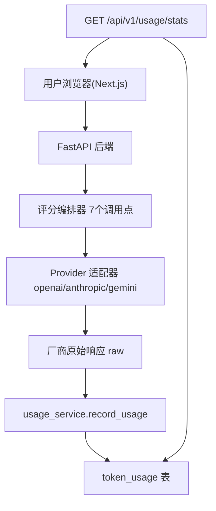

# Token 消耗统计技术方案

版本: V1.0
日期: 2026-08-16
适用范围: `backend/`（FastAPI + SQLAlchemy + Provider 抽象层）、`frontend/`（Next.js 15 + React 19 + TypeScript + Tailwind v4）
关联需求: 「Token 消耗统计」——每次 AI 调用统计 Prompt / Completion / 总 Token，后台按厂商统计今日消耗，便于控制成本

---

## 1. 背景与目标

### 1.1 需求描述

```
每次：
  Prompt:  1300 Token
  Completion:  900 Token
  总:  2200

后台统计（今天）：
  GPT:     30万
  Claude:   8万
  DeepSeek: 15万

方便控制成本。
```

拆解为三层能力：

| 需求 | 含义 | 本方案落点 |
| --- | --- | --- |
| 单次调用明细 | 每次 AI 调用都记录 prompt_tokens / completion_tokens / total_tokens | Provider 抽象层统一采集（第 4 节） |
| 后台按厂商汇总 | 按 Provider（GPT / Claude / DeepSeek）聚合某时间窗内的 Token 总量 | 新增统计接口（第 5 节） |
| 成本控制 | 让管理员直观看到各厂商消耗 | 前端后台新增「用量统计」页 + 可选成本估算（第 6、7 节） |

### 1.2 现状分析

当前系统所有 LLM 调用都经过统一的 Provider 抽象层，这是本需求的天然采集点：

| 环节 | 现状 | 与本需求的关系 |
| --- | --- | --- |
| Provider 抽象层 | `BaseLLMProvider.chat()` 是唯一出口，三种适配器（openai_compat / anthropic / gemini）各自返回 `ProviderChatResult`，`raw` 字段携带厂商原始响应 | **所有调用在此汇聚**，只需在这里解析并落库即可全覆盖，无需改动任何业务编排器 |
| 厂商用量字段 | OpenAI 兼容协议返回 `usage`；Claude 返回 `usage`；Gemini 返回 `usageMetadata` | 三种字段结构不同，需要统一为 `LLMUsage` 抽象 |
| 调用场景 | 已有 7 处 `provider.chat()` 调用点（题型识别 / 诊断 / 评价 / Consensus / 标准答案 / 双角色阅卷官与教练 / 连通性测试） | 需要为每次调用标注 `scene`，便于分析哪个环节消耗大 |
| 数据库 | 使用 SQLAlchemy + `Base.metadata.create_all`（启动自动建表），近期表均有 alembic 迁移 | 新增 `token_usage` 表，开发环境靠 `create_all` 自动创建 |
| 后台页面 | `/admin/providers` 已用 Tab 组织「设置 / Prompt 库」 | 新增「用量统计」Tab，风格完全复用 |

### 1.3 改造目标

1. **零侵入采集**：不改动任何评分编排逻辑，只在 Provider 适配器内解析用量并异步落库。
2. **按厂商聚合**：后台统计接口按 Provider 汇总 Token 总量与调用次数，支持时间窗（今天 / 昨天 / 近 7 天 / 近 30 天 / 全部）。
3. **成本可估算**：可选地根据模型单价（配置在 Provider 的 `extra`）估算消耗金额，直观控制成本。
4. **失败无损**：用量记录失败不影响主链路，异步写入 + 异常吞掉 + 日志告警。
5. **向后兼容**：现有接口、前端行为完全不变，新能力全部为增量新增。

### 1.4 验收标准映射

| 验收标准 | 对应设计 |
| --- | --- |
| 每次调用能看到 Prompt / Completion / 总 Token | 单次调用落库字段（第 3、4 节） |
| 后台「今天」按 GPT/Claude/DeepSeek 显示 Token 总量 | 统计接口 + 前端聚合（第 5、6 节） |
| 便于控制成本 | 成本估算字段与前端金额展示（第 7 节） |

---

## 2. 总体设计

### 2.1 架构图



### 2.2 设计原则

1. **单一采集点**：在 `BaseLLMProvider.chat()` 的适配器实现内统一解析 `raw` 中的用量字段，业务层（评分编排器）完全不感知统计的存在。
2. **异步写库**：落库用 `asyncio.create_task` 后台执行，不阻塞 LLM 调用返回；写入异常只记日志。
3. **结构化场景**：为 `chat()` 增加可选 `scene` 参数，调用点标注用途（如 `diagnosis` / `evaluation` / `consensus`），便于定位高消耗环节。
4. **统计解耦**：聚合查询是纯 DB 层 `GROUP BY`，接口只做参数校验与响应封装，可单测。
5. **厂商差异隔离**：各厂商的用量字段差异封装在各自适配器内，统一收敛为 `LLMUsage(prompt_tokens, completion_tokens, total_tokens)`。

---

## 3. 数据模型设计

### 3.1 新增 token_usage 表

每行 = 一次真实的 LLM API 调用。

```python
class TokenUsage(Base):
    __tablename__ = "token_usage"

    id = Column(String, primary_key=True, index=True)
    provider_id = Column(String, index=True)       # AiProvider.id（或 seed-default）
    provider_name = Column(String, nullable=False) # 显示名，冗余快照，防删改漂移
    provider_type = Column(String(50))             # openai|claude|gemini|deepseek|qwen|custom
    model = Column(String(100))                    # 模型名
    scene = Column(String(50), index=True)         # qtype_detection|diagnosis|evaluation|consensus|standard_answer|grader|coach|test
    prompt_tokens = Column(Integer, default=0)     # 输入 Token
    completion_tokens = Column(Integer, default=0) # 输出 Token
    total_tokens = Column(Integer, default=0)      # 输入 + 输出
    created_at = Column(DateTime, default=datetime.utcnow, nullable=False, index=True)
```

要点：

- **provider_name 冗余快照**：即便管理员后续改名/删除 Provider，历史统计不受影响。
- **字段缺省 0**：部分中转站/网关不返回 `usage` 时记录 0，但**调用次数始终准确**，成本汇总时以「调用次数」为准修正偏差。
- **建表方式**：开发环境由 `Base.metadata.create_all` 自动创建（`main.py` 启动钩子已覆盖）；生产环境补充一个 alembic 迁移文件（对齐现有 `20260813_0001_add_prompt_tables.py` 风格）。
- **索引**：`created_at` + `provider_id` 联合覆盖统计查询；`scene` 用于场景分析。

### 3.2 字段枚举：scene

| scene | 调用点 | 说明 |
| --- | --- | --- |
| `qtype_detection` | `ai_service.py` 的 `get_question_type_from_ai` | 题型识别 |
| `diagnosis` | `ai_service.py` 双阶段第一阶段 | 专业诊断 |
| `evaluation` | `ai_service.py` 双阶段第二阶段 | 整体评价 |
| `consensus` | `grading/orchestrator.py` 的 `_generate_consensus` | 多模型共识汇总 |
| `standard_answer` | `grading/standard_answer.py` | 标准答案生成 |
| `grader` | `grading/dual_role.py` 的 `_run_role` | 双角色·阅卷官 |
| `coach` | `grading/dual_role.py` 的 `_run_role` | 双角色·写作教练 |
| `test` | `provider_service.py` 的 `test_provider` | 连通性测试（小调用，可在统计中过滤） |

---

## 4. 后端设计

### 4.1 Provider 抽象层改造（backend/app/services/providers/base.py）

**目标：统一用量结构 + 提供采集钩子。**

```python
@dataclass
class LLMUsage:
    """厂商无关的用量结构"""
    prompt_tokens: int = 0
    completion_tokens: int = 0
    total_tokens: int = 0


@dataclass
class ProviderChatResult:
    content: str
    reasoning_content: Optional[str] = None
    raw: Optional[Any] = None
    usage: Optional[LLMUsage] = None   # 新增
```

- `chat()` 签名增加可选参数 `scene: Optional[str] = None`（不影响现有调用方，未传默认 `None` 记 `unknown`）。
- 新增非抽象助手方法，供各适配器在返回前调用：

```python
def _record_usage(self, raw: Any, scene: Optional[str], usage: Optional[LLMUsage]) -> None:
    if usage is None:
        return
    usage_service.schedule_record(
        provider_id=self.id,
        provider_name=self.name,
        provider_type=self.provider_type,
        model=self.model,
        scene=scene,
        usage=usage,
    )
```

### 4.2 各适配器解析用量（3 个文件，每个约 +10 行）

**openai_compat.py**（OpenAI / DeepSeek / Qwen / custom）：

```python
usage = None
u = getattr(response, "usage", None)
if u is not None:
    usage = LLMUsage(
        prompt_tokens=getattr(u, "prompt_tokens", 0) or 0,
        completion_tokens=getattr(u, "completion_tokens", 0) or 0,
        total_tokens=getattr(u, "total_tokens", 0)
        or (getattr(u, "prompt_tokens", 0) or 0) + (getattr(u, "completion_tokens", 0) or 0),
    )
self._record_usage(response, scene, usage)
```

**anthropic.py**（Claude）：

```python
usage = None
u = data.get("usage") or {}
if u:
    input_tokens = int(u.get("input_tokens") or 0)
    output_tokens = int(u.get("output_tokens") or 0)
    usage = LLMUsage(
        prompt_tokens=input_tokens,
        completion_tokens=output_tokens,
        total_tokens=input_tokens + output_tokens,
    )
self._record_usage(data, scene, usage)
```

**gemini.py**：

```python
usage = None
um = data.get("usageMetadata") or {}
if um:
    prompt_tokens = int(um.get("promptTokenCount") or 0)
    completion_tokens = int(um.get("candidatesTokenCount") or 0)
    usage = LLMUsage(
        prompt_tokens=prompt_tokens,
        completion_tokens=completion_tokens,
        total_tokens=prompt_tokens + completion_tokens,
    )
self._record_usage(data, scene, usage)
```

> 注意：`max_tokens` / 推理模型（`reasoning_content`）由厂商在 usage 中统一计费，此处不做手工累加，避免重复计数。

### 4.3 用量记录服务（新增 backend/app/services/usage_service.py）

```python
def schedule_record(*, provider_id, provider_name, provider_type,
                    model, scene, usage) -> None:
    """异步落库：asyncio.create_task + SessionLocal，失败仅记日志。"""
    async def _do():
        try:
            with SessionLocal() as db:
                db.add(TokenUsage(
                    id=str(uuid.uuid4()),
                    provider_id=provider_id,
                    provider_name=provider_name,
                    provider_type=provider_type,
                    model=model,
                    scene=scene or "unknown",
                    prompt_tokens=usage.prompt_tokens,
                    completion_tokens=usage.completion_tokens,
                    total_tokens=usage.total_tokens,
                ))
                db.commit()
        except Exception:
            logger.exception("Token 用量记录失败: provider=%s", provider_name)
    try:
        asyncio.create_task(_do())
    except RuntimeError:
        # 无事件循环（同步上下文，如启动种子）时同步兜底
        logger.warning("无事件循环，Token 用量记录跳过")
```

**失败降级**：任何异常只记日志，绝不影响评分主链路；`RuntimeError`（无事件循环）场景跳过记录。

### 4.4 调用点标注 scene（7 处小改动）

每个 `provider.chat(...)` 调用增加一个 `scene="..."` 关键字参数即可，调用参数本身零改动：

| 文件 | 行 | 增加参数 |
| --- | --- | --- |
| `ai_service.py` 题型识别 | 641 | `scene="qtype_detection"` |
| `ai_service.py` 第一阶段 | 287 | `scene="diagnosis"` |
| `ai_service.py` 第二阶段 | 318 | `scene="evaluation"` |
| `grading/orchestrator.py` | 133 | `scene="consensus"` |
| `grading/standard_answer.py` | 44 | `scene="standard_answer"` |
| `grading/dual_role.py` | 77 | `scene="grader"`（按 role key 区分 grader/coach） |
| `provider_service.py` | 152 | `scene="test"` |

### 4.5 统计接口（新增 backend/app/api/endpoints/usage.py）

```
GET /api/v1/usage/stats?range=today&group_by=provider&exclude_test=true
```

| 参数 | 取值 | 默认 | 说明 |
| --- | --- | --- | --- |
| `range` | `today` / `yesterday` / `7d` / `30d` / `all` | `today` | 时间窗 |
| `group_by` | `provider` / `model` / `scene` | `provider` | 聚合维度 |
| `exclude_test` | `true` / `false` | `true` | 是否剔除连通性测试的小调用 |

响应结构（`group_by=provider`）：

```json
{
  "range": "today",
  "start": "2026-08-16T00:00:00",
  "end": "2026-08-16T23:59:59",
  "summary": {
    "callCount": 128,
    "promptTokens": 166400,
    "completionTokens": 115200,
    "totalTokens": 281600
  },
  "items": [
    {
      "providerId": "xxx",
      "providerName": "GPT",
      "providerType": "openai",
      "model": "gpt-4o",
      "callCount": 60,
      "promptTokens": 180000,
      "completionTokens": 120000,
      "totalTokens": 300000,
      "estimatedCost": 1.35
    }
  ]
}
```

实现要点：

- 时间窗换算：`today` → 当日 0 点；`yesterday` → 昨日 0~24 点；`7d` / `30d` → 最近 N 天；`all` → 不加时间过滤。
- 聚合 SQL（SQLAlchemy）：

```python
rows = (
    db.query(
        TokenUsage.provider_id,
        TokenUsage.provider_name,
        TokenUsage.provider_type,
        func.sum(TokenUsage.prompt_tokens),
        func.sum(TokenUsage.completion_tokens),
        func.sum(TokenUsage.total_tokens),
        func.count(TokenUsage.id),
    )
    .filter(*time_filters)
    .group_by(TokenUsage.provider_id, TokenUsage.provider_name, TokenUsage.provider_type)
    .all()
)
```

- `exclude_test=true` 时追加 `TokenUsage.scene != "test"`。
- `estimatedCost` 默认 `null`，仅在 Provider 配置了单价（见第 7 节）时计算。

### 4.6 注册路由

- 新建 `backend/app/api/endpoints/usage.py`，在 `main.py` 中 `app.include_router(usage.router, prefix="/api/v1", tags=["usage"])`。
- 新增模型在 `backend/app/models/__init__.py` 中导出，保证 `create_all` 建表。

---

## 5. 成本估算（可选，对应「方便控制成本」）

在 `AiProvider.extra` 增加两个可选字段，由管理员在设置页填写：

```json
{
  "cost_per_1k_input": 0.005,    // 元 / 千 input tokens
  "cost_per_1k_output": 0.015    // 元 / 千 output tokens
}
```

统计接口计算：

```python
cost = prompt_tokens / 1000 * input_price + completion_tokens / 1000 * output_price
```

- 未配置单价的 Provider 返回 `estimatedCost: null`，前端展示「—」，不影响 Token 汇总。
- 好处：无需改代码即可适配不同厂商实时调价，直接用于成本控制。

---

## 6. 前端设计

### 6.1 页面入口

复用 `/admin/providers` 的 Tab 机制，新增第三个 Tab「用量统计」：

```
[设置] [Prompt 库] [用量统计]   ← 新增
```

`frontend/src/app/admin/providers/page.tsx` 中：

```ts
const [activeTab, setActiveTab] = useState<"providers" | "prompts" | "usage">("providers");
```

### 6.2 用量统计面板（新增 frontend/src/components/admin/UsageStatsPanel.tsx）

布局：

1. **时间窗选择**：`今天 / 昨天 / 近7天 / 近30天 / 全部` 分段按钮（复用现有 `inline-flex` Tab 样式）。
2. **汇总卡片**（复用 `Card` 组件，一行 4 张）：
   - 今日调用次数
   - Prompt Token 总量
   - Completion Token 总量
   - 总 Token 总量
3. **按厂商明细表**（复用现有表格样式）：厂商 / 模型 / 调用次数 / Prompt / Completion / 合计 / 估算成本（¥）。

数据获取：

```ts
const res = await fetch(`${API_BASE_URL}/api/v1/usage/stats?range=${range}&group_by=provider`);
```

新类型放 `frontend/src/types/usage.ts`：

```ts
export interface UsageItem {
  providerId: string;
  providerName: string;
  providerType: string;
  model: string;
  callCount: number;
  promptTokens: number;
  completionTokens: number;
  totalTokens: number;
  estimatedCost?: number | null;
}

export interface UsageStats {
  range: string;
  start?: string;
  end?: string;
  summary: { callCount: number; promptTokens: number; completionTokens: number; totalTokens: number };
  items: UsageItem[];
}
```

### 6.3 数字格式化

大数字（如 300000）展示为 `30万`：封装 `formatTokens(n)` 工具函数（`>=10000` 时 `n/10000` 保留 1 位小数加「万」），贴合需求原文「30万 / 8万 / 15万」的阅读习惯。

### 6.4 单次调用明细（可选增强）

若需要向普通用户展示单次批改的 Token 消耗（需求原文「每次」），可在多模型 / 双角色 / 可信度等 SSE 的 `done` 事件中附加该次请求的总用量汇总（各子调用 `usage` 之和），前端在结果区展示一行「本次消耗 X Token」。默认本期只做后台统计，该增强作为二期选项。

---

## 7. 实施步骤

| 步骤 | 内容 | 涉及文件 |
| --- | --- | --- |
| 1 | 新增 `LLMUsage`、扩展 `ProviderChatResult`、`_record_usage` 钩子 | `backend/app/services/providers/base.py` |
| 2 | 三个适配器解析用量并调用 `_record_usage` | `openai_compat.py` / `anthropic.py` / `gemini.py` |
| 3 | 新增 `TokenUsage` 模型并导出 | `backend/app/models/usage.py`、`models/__init__.py` |
| 4 | 新增 `usage_service`（异步落库） | `backend/app/services/usage_service.py` |
| 5 | 7 处调用点标注 `scene` | 见第 4.4 节表格 |
| 6 | 新增统计接口 | `backend/app/api/endpoints/usage.py`、`main.py` |
| 7 | 前端类型 + 统计面板 + 页面 Tab | `frontend/src/types/usage.ts`、`UsageStatsPanel.tsx`、`admin/providers/page.tsx` |
| 8 | 生产迁移文件（对齐 alembic 风格） | `backend/alembic/versions/20260816_0001_add_token_usage.py` |

## 8. 验证与测试

1. **单测**（`backend/tests/`）：
   - 适配器用量解析：mock 三类厂商响应（OpenAI `usage`、Anthropic `input/output_tokens`、Gemini `usageMetadata`、缺失 `usage`），断言 `LLMUsage` 字段。
   - 统计聚合：插入若干条跨天 / 跨厂商 / 含 `test` 场景的 `TokenUsage`，断言各 `range` 过滤与 `GROUP BY` 结果。
   - `exclude_test` 过滤逻辑。
2. **接口联调**：真实调用一次评分（任选一个已配置 Provider），确认 `token_usage` 表新增 N 行且 `scene` 正确；调用 `/api/v1/usage/stats?range=today` 校验汇总。
3. **前端验收**：后台「用量统计」Tab 展示「今天 / 昨天 / 近7天 / 近30天 / 全部」，按厂商显示 Token 总量（大数格式化为「万」），与 SQL 查询结果一致。
4. **回归**：评分 / 多模型 / 可信度 / 双角色 / Prompt 库全链路行为不变，用量记录失败不阻塞主流程（可临时注入异常验证降级路径）。

## 9. 风险与取舍

| 风险 / 取舍 | 说明 | 对策 |
| --- | --- | --- |
| 厂商不返回 usage | 部分中转站 / 网关无 usage 字段，Token 记 0 | 调用次数始终准确；前端成本列显示「—」；可二期引入 tiktoken 估算（默认关闭） |
| 冗余快照 vs 外键 | `provider_name` 冗余存储 | 接受冗余换取统计不随配置变更漂移 |
| 异步写库可靠性 | `asyncio.create_task` 在进程退出时可能丢失少量尾部记录 | 属可接受精度损失；如需强一致改为同步写（约多 1~2ms/调用） |
| 统计口径 | `total_tokens` 以厂商返回为准，不手工累加推理 token | 避免重复计数，推理计费由厂商承担 |
| 成本估算依赖单价配置 | 默认不配置即无成本列 | 设置页引导填写 `extra` 单价，改价不发布版本 |
