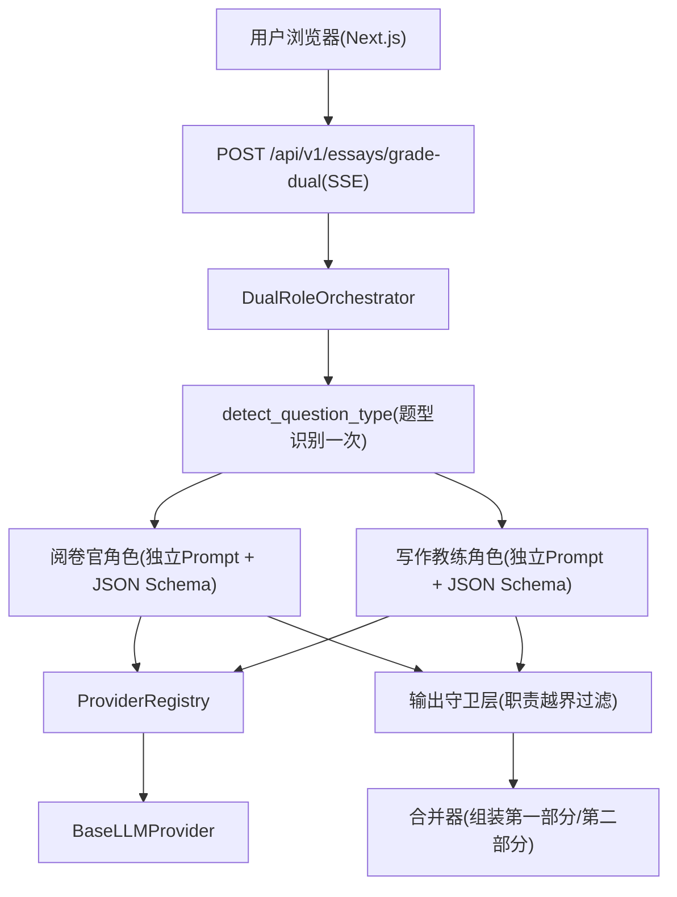

# 双角色 AI 批改技术方案

版本: V1.0
日期: 2026-08-11
适用范围: `backend/`（FastAPI + Provider 抽象层）、`frontend/`（Next.js 15 + React 19 + TypeScript + Tailwind v4）
关联需求: 「双角色 AI 批改」——将当前一次性评价拆分为两个完全独立的 AI 角色：阅卷官（只打分、只讲失分与评分依据）与写作教练（只给修改建议、语言优化与示例改写）

---

## 1. 背景与目标

### 1.1 现状分析

当前评分链路（`grade_essay_with_expert_diagnosis`，见 `backend/app/services/ai_service.py:259`）为「诊断 + 整体评价」两阶段，但两个阶段都由同一个"阅卷专家"人设完成，评价与改进建议混在一起输出，导致：

| 问题 | 具体表现 |
| --- | --- |
| 角色混淆 | 同一个人设既要打分又要给改写建议，职责边界模糊 |
| 结果偏向一次性评价 | 打分段落在输出中占据主导，写作指导被稀释，缺少针对性的逐段建议 |
| 输出无结构 | 评分、失分、建议混在自由文本中，无法按「评分 / 写作建议」两部分清晰呈现 |
| Prompt 互相干扰 | 打分指令与润色指令写在同一 Prompt 中，模型在两者间摇摆 |

### 1.2 改造目标

1. **拆分为两个独立角色**：阅卷官（打分 / 扣分原因 / 评分依据）与写作教练（修改建议 / 语言优化 / 示例改写），两个 Prompt 完全独立。
2. **职责硬隔离**：阅卷官 Prompt 中不含任何润色改写指令；写作教练 Prompt 中不含任何打分指令。
3. **结构化输出**：第一部分的评分（单一总分 + 主要失分①②③）与第二部分的写作建议（按段落组织）分离呈现。
4. **并发执行、失败隔离**：两个角色并行调用，互不阻塞，单个角色失败不影响另一个。
5. **向后兼容**：现有 `/grade`、`/grade-multi`、`/grade-progressive` 接口行为不变。
6. **标准答案按需查看**：教练默认不输出整篇范文；用户在页面确认"是否需要查看标准答案"后，由独立流程生成整篇范文与标准答案解释。

### 1.3 验收标准映射

| 验收标准 | 对应设计 |
| --- | --- |
| 两个 Prompt 完全独立 | 独立 Prompt 构建器（第 4 节）+ 三层职责隔离（第 3 节）+ 单元测试断言（第 8 节） |
| 阅卷官只打分/扣分原因/评分依据 | 阅卷官 Prompt 禁止段 + 专用 JSON Schema（第 3.2 节） |
| 写作教练只给修改建议/语言优化/示例改写 | 写作教练 Prompt 禁止段 + 专用 JSON Schema（第 3.3 节） |
| 输出分为「评分」与「写作建议」两部分 | 合并结果结构 + 前端双区块渲染（第 5、6.2 节） |
| 教练默认不输出范文；用户确认后按需查看标准答案 | 独立标准答案 Prompt + 独立接口 + 前端确认交互（第 3.5、4.5、5.4 节） |

---

## 2. 总体架构

### 2.1 架构图



### 2.2 设计原则

1. **Prompt 零耦合**：两个 Prompt 均由同一份原始输入（题目材料 + 作答 + 题型）独立构建，互相不引用对方的输出，这是"完全独立"的实现保证，同时天然支持并发。
2. **职责三层隔离**：Prompt 层（禁止指令）→ Schema 层（结构化约束）→ 输出守卫层（解析后越界内容过滤），纵深防御。
3. **编排复用**：直接复用多模型编排器的并发 / 失败隔离模式（`asyncio.gather(return_exceptions=True)` + 信号量），不重复造轮子。
4. **失败互不影响**：阅卷官失败时写作教练照常出结果，`done` 事件中对应角色标记 `error`，前端显示占位。
5. **单次题型识别**：题型识别一次，两个角色复用，避免重复计费。

---

## 3. 角色与 Prompt 设计（核心）

### 3.1 角色定义

| 角色 | Key | 人设 | 唯一职责 | 硬禁止 |
| --- | --- | --- | --- | --- |
| 阅卷官 | `grader` | 资深申论阅卷官 | 打分（单一总分）、主要失分①②③、评分依据 | 润色、改写、给出改进建议 |
| 写作教练 | `coach` | 申论写作教练 | 修改建议、语言优化、示例改写（原句→优化句） | 再次评分、输出整篇范文/标准答案 |

需求措辞说明（约定解释，可在常量中配置）:

- 「示例改写」：指对**学生原文句子**的改写示范，格式 `原句 → 优化句`，属于教练职责范围内。
- 「输出示例」：指输出**整篇范文/标准答案**，属于教练的硬禁止项，**默认不生成**。
- 「按需查看标准答案」：批改完成后，由用户在页面**主动确认**（"是否需要查看标准答案"）后，才通过**独立的标准答案生成流程**输出整篇范文与标准答案解释；该流程不属于写作教练角色，不破坏"两个 Prompt 完全独立"的验收标准。

### 3.2 阅卷官 Prompt（`build_grader_prompt`）

```text
你是资深申论阅卷官，有20年阅卷经验。

=== 输入 ===
【题目材料与题干】
{question_material}

【学生作答】
{answer}

【题型】{question_type}

=== 唯一职责 ===
只做三件事：
1. 给出唯一总分（满分100分）
2. 列出主要失分点（2-4条，按影响程度排序，每条注明扣分原因与评分依据）
3. 给出评分依据（基于{question_type}的评分维度，说明每一维度的得分与扣分依据）

=== 硬性禁止（违反即不合格） ===
- 禁止润色学生原文
- 禁止改写学生句子
- 禁止给出任何"如何改进""可以这样写"之类的写作建议
- 禁止输出范文或示例段落

=== 输出格式 ===
只输出一个 JSON，禁止任何多余文字：
{
  "total_score": 72,
  "score_breakdown": [
    {"item": "内容要点", "full_score": 40, "actual_score": 28}
  ],
  "main_deductions": [
    {"reason": "概括要点遗漏，未覆盖材料中的'...'", "deducted": 3}
  ],
  "scoring_basis": "依据{题型}评分标准：..."
}
```

字段约束（写入 Schema 层）：

| 字段 | 类型 | 说明 |
| --- | --- | --- |
| `total_score` | number, 0-100 | 唯一总分，必须为整数 |
| `score_breakdown` | array | 维度拆分，仅作透明度展示，不要求其和等于总分 |
| `main_deductions` | array | 2-4 条主要失分，每条含 `reason` 与可选的 `deducted`（扣分值） |
| `scoring_basis` | string | 评分依据说明 |

### 3.3 写作教练 Prompt（`build_coach_prompt`）

```text
你是申论写作教练，擅长帮学生提升表达。

=== 输入 ===
【题目材料与题干】
{question_material}

【学生作答】
{answer}

【题型】{question_type}

=== 唯一职责 ===
逐段诊断学生作答，只给出：
1. 修改建议：该段应如何调整结构/内容
2. 语言优化：指出该段中表达不当之处并说明原因
3. 示例改写：对学生原文句子给出改写示范，格式"原句 → 优化句"并说明改写理由

=== 硬性禁止（违反即不合格） ===
- 禁止打分、禁止评论分数
- 禁止给出总分或任何分数
- 禁止输出整篇范文或标准答案（只允许针对学生句子的改写示范）

=== 输出格式 ===
只输出一个 JSON，禁止任何多余文字：
{
  "paragraph_advice": [
    {
      "paragraph": "第一段",
      "diagnosis": "该段存在的主要问题",
      "suggestions": ["建议1", "建议2"],
      "rewrites": [
        {"original": "学生原句", "optimized": "优化后句子", "why": "改写理由"}
      ]
    }
  ],
  "overall_advice": "整体写作建议（可选）"
}
```

字段约束（写入 Schema 层）：

| 字段 | 类型 | 说明 |
| --- | --- | --- |
| `paragraph_advice` | array | 按段落组织，仅包含**有改进空间的段落**（已达标段落可跳过，与需求示例中只列"第一段、第三段"一致） |
| `paragraph_advice[].paragraph` | string | 段落标识，如"第一段" |
| `paragraph_advice[].diagnosis` | string | 该段问题诊断 |
| `paragraph_advice[].suggestions` | array | 修改建议 |
| `paragraph_advice[].rewrites` | array | 示例改写（`original`/`optimized`/`why`） |
| `overall_advice` | string | 可选，整体写作建议 |

### 3.4 独立性保证（三层隔离）

| 层级 | 手段 | 说明 |
| --- | --- | --- |
| 1. Prompt 层 | 各自的"硬性禁止"段 | 阅卷官禁止润色/改写/建议；教练禁止打分/范文 |
| 2. Schema 层 | 各自独立的输出字段 | 教练输出无任何 `score` 字段；阅卷官输出无任何 `rewrites` 字段，从结构上杜绝越界 |
| 3. 输出守卫层 | 解析后校验 + 过滤（`backend/app/services/grading/dual_role.py`） | 见第 4.3 节 |

### 3.5 标准答案按需生成（用户主动确认后触发）

整篇范文与标准答案解释**不作为任何角色的默认输出**，仅当用户在结果页主动确认"是否需要查看标准答案"后，由独立的第三个 Prompt（`build_standard_answer_prompt`）生成：

```text
你是申论标准答案撰写专家。

=== 输入 ===
【题目材料与题干】
{question_material}

【题型】{question_type}

=== 任务 ===
1. 根据题目与材料撰写一篇完整标准答案范文
2. 给出标准答案解释：本题的答题要点、评分点、为什么这样答

=== 输出格式 ===
{
  "standard_answer": "完整范文",
  "explanation": "标准答案解释（答题要点与评分点说明）"
}
```

要点：

- 该 Prompt 只依赖 `question_material + question_type`，**不输入学生作答**，保证范文客观、不被学生答案干扰。
- 该流程独立于双角色编排器，走单独的接口与加载状态，不影响阅卷官 / 写作教练结果。
- 这是唯一允许输出整篇范文的入口，且必须由用户显式确认才触发。

---

## 4. 后端设计

### 4.1 新增文件

```
backend/app/
  services/
    prompt_service_dual.py      # build_grader_prompt / build_coach_prompt / build_standard_answer_prompt
    grading/
      dual_role.py              # DualRoleOrchestrator：并发编排 + 输出守卫 + 合并器
      standard_answer.py        # 标准答案生成（用户确认后触发）
  schemas/
    dual_role.py                # GraderResult / CoachResult / DualRoleResult / GradeDualRequest / StandardAnswerResult
  api/
    endpoints/
      dual_role.py              # POST /api/v1/essays/grade-dual + POST /api/v1/essays/standard-answer
```

复用现有能力，不重复实现：

- `ProviderRegistry` / `BaseLLMProvider.chat()`（`backend/app/services/providers/`）
- 题型识别 `detect_question_type`（`backend/app/services/grading/orchestrator.py:56`）
- JSON 容错解析 `try_parse_json_response`（`backend/app/services/ai_service.py:509`）
- Unicode 清理 `clean_unicode_text`、Prompt 泄漏清理 `clean_ai_thinking_patterns`

### 4.2 双角色编排器（`grading/dual_role.py`）

```python
ROLES = [
    {"key": "grader", "name": "阅卷官", "build_prompt": build_grader_prompt, "schema": GraderResult},
    {"key": "coach",  "name": "写作教练", "build_prompt": build_coach_prompt, "schema": CoachResult},
]

async def grade_dual_stream(content, question_type, provider) -> AsyncGenerator[dict, None]:
    # 1. 题型识别一次
    qtype, qsource = await detect_question_type(content, question_type)

    yield {"type": "roles_started", "roles": [...], "questionType": qtype, ...}

    # 2. 并发调用两个角色（信号量 + gather，失败隔离）
    async def run_role(role):
        prompt = role["build_prompt"](question_text, answer, qtype)   # 独立构建，零耦合
        result = await provider.chat(messages=[{"role": "user", "content": prompt}], ...)
        return role["schema"].model_validate(parse_ai_json(result.content))  # Schema 层校验

    results = await asyncio.gather(*(run_role(r) for r in ROLES), return_exceptions=True)

    # 3. 逐角色：输出守卫 -> yield role_result / role_error
    # 4. 合并 -> yield done（含 combined，见 4.4）
```

要点：

- 两个角色使用**同一 Provider**（默认取默认模型，请求可传 `provider_id`），也可配置独立模型（见第 4.4 节请求体）。
- `question_text` 与 `answer` 从 `content` 按既有约定切分（`【题目材料与题干】` / `【我的作答】`），传给两个 Prompt 的原始输入完全一致。
- 每个角色独立超时，超时/异常只标记该角色 `error`，不影响另一个。

### 4.3 输出守卫层

在 Schema 校验后、进入合并器前执行：

```python
def guard_grader(raw: dict) -> dict:
    # 阅卷官输出中不允许出现改写建议痕迹
    drop_keys = [k for k in raw if k in {"rewrites", "optimized", "suggestions"}]
    return {k: v for k, v in raw.items() if k not in drop_keys}

def guard_coach(raw: dict) -> dict:
    # 教练输出中不允许出现任何分数
    if "total_score" in raw or "score" in raw:
        raw.pop("total_score", None); raw.pop("score", None)
    # 递归删除 paragraph_advice 中的 score / 打分字段
    ...
```

守卫失败（如教练输出缺失全部字段）时该角色降级为 `error` 或置空，不阻塞合并。

### 4.4 API 接口与结果结构

`POST /api/v1/essays/grade-dual`

请求体（复用 `MultiGradingRequest` 模式，新增 `provider_id`）：

```json
{
  "content": "【题目材料与题干】...\n\n【我的作答】...",
  "question_type": "综合分析题",
  "provider_id": ""   // 空则用默认模型
}
```

SSE 事件流（沿用现有 `text/event-stream` 约定）：

| 事件 | data 结构 | 说明 |
| --- | --- | --- |
| `roles_started` | `{ roles: [{key,name}], questionType, questionTypeSource }` | 已确认的两个角色清单 |
| `role_start` | `{ role: "grader" }` | 单个角色开始 |
| `role_result` | `{ role: "grader", data: {GraderResult} }` | 单个角色成功结果 |
| `role_error` | `{ role: "coach", message }` | 单个角色失败（不影响另一个） |
| `done` | `{ grader, coach, combined, questionType, questionTypeSource }` | 全部完成 + 合并结果 |

`done.combined` 合并结构（对应需求中的最终排版）：

```json
{
  "part1": {
    "score": 72,
    "mainDeductions": [
      "① 概括要点遗漏，未覆盖材料中'...'",
      "② 逻辑层次不清，第X段与第Y段重复论证",
      "③ 语言不够凝练，口语化表述过多"
    ],
    "scoringBasis": "依据概括题评分标准：..."
  },
  "part2": {
    "paragraphAdvice": [
      {
        "paragraph": "第一段",
        "diagnosis": "...",
        "suggestions": ["建议……"],
        "rewrites": [{"original": "原句", "optimized": "优化句", "why": "理由"}]
      },
      { "paragraph": "第三段", "suggestions": ["建议……"] }
    ],
    "overallAdvice": "（可选）"
  }
}
```

约定：`mainDeductions` 由后端根据 `main_deductions[]` 数组统一生成 `① ② ③` 前缀，保证编号一致、不被模型擅自加号。

### 4.5 标准答案接口（用户确认后触发）

`POST /api/v1/essays/standard-answer`

请求体：

```json
{ "content": "【题目材料与题干】...", "question_type": "综合分析题" }
```

- 后端从 `content` 中切出题目部分（按 `【我的作答】` 分割），仅将题目传给 `build_standard_answer_prompt`。
- 响应（单次 JSON，非 SSE）：

```json
{ "standardAnswer": "完整范文", "explanation": "标准答案解释" }
```

- 生成成功后将结果追加写入历史（`kind = "standard_answer"`，`extra.parent_id` 关联对应 `grade_dual` 记录），供历史页回看。
- 该接口与双角色编排器完全解耦：阅卷官/写作教练是否完成、是否失败都不影响它。

### 4.6 历史记录

复用 `history` 表（`append_history`，见 `backend/app/services/history_service.py:13`）：

- `kind = "grade_dual"`：双角色批改主记录
  - `request = { content, question_type, provider_id }`
  - `response = { grader, coach, combined, questionType, questionTypeSource }`
  - `score` 取 `grader.total_score`（用于历史列表展示）
- `kind = "standard_answer"`：用户查看标准答案后追加的关联记录
  - `request = { content, question_type }`
  - `response = { standardAnswer, explanation }`
  - `extra.parent_id` 指向所属 `grade_dual` 记录的 id

### 4.7 现有接口

`/grade`、`/grade-multi`、`/grade-progressive`、`/grade-simple` 行为完全不变，双角色作为新增能力独立存在。

---

## 5. 前端设计

### 5.1 入口：批改模式切换

在 `/app/essay/page.tsx` 顶部新增「批改模式」切换（复用现有 `Badge`/`Button` 样式）：

```text
批改模式: [ 双角色批改 ] [ 多模型阅卷 ]
```

- 默认「双角色批改」（新需求）。切换「多模型阅卷」时走现有 `useGradeMulti` + `MultiResultView`。
- 双角色模式下隐藏模型多选框，只保留一个「阅卷模型」下拉（默认模型），提交走新 hook。

### 5.2 结果展示（`DualRoleResultView`）

按需求排版渲染两个部分（顶部带题型 Badge）：

**第一部分 · 阅卷官**
- 大号总分（`part1.score`）+ `ScoreBar`
- 「主要失分」列表：`part1.mainDeductions[]`，渲染 `① ② ③`
- 「评分依据」：`part1.scoringBasis`（`Disclosure` 折叠展示）
- 阅卷官失败时显示错误占位卡

**第二部分 · 写作教练**
- 「写作建议」：按 `part2.paragraphAdvice[]` 渲染段落卡片
  - 段落标题（第一段/第三段）+ 问题诊断
  - 修改建议列表
  - 示例改写：`原句 → 优化句` 上下对照，附改写理由
- `overallAdvice` 作为整体建议折叠区
- 教练失败时显示错误占位卡，第一部分照常展示

复用现有 `Card` / `Disclosure` / `ScoreBar` / `Badge` / `renderRichText`（`MultiResultView.tsx:26`）等组件与样式。

**标准答案区（用户确认后按需展示）**
- 位于第二部分下方：未查看时展示提示区「是否需要查看标准答案？」+「查看标准答案」按钮（可配说明文案，见 5.4）。
- 点击后弹出确认，确认后按钮转 loading，调用 `useGradeDual.fetchStandardAnswer()`。
- 完成后下方展开「标准答案范文」（整篇）与「标准答案解释」（答题要点 + 评分点）两个折叠区。

### 5.3 类型与 Hook

- `frontend/src/types/grading.ts` 新增：
  - `DualRoleResult`、`GraderResult`、`CoachResult`、`ParagraphAdvice`、`CombinedDualResult`
  - `DualRolesStartedEvent` / `DualRoleResultEvent` / `DualRoleErrorEvent` / `DualDoneEvent`
  - `StandardAnswerResult = { standardAnswer: string; explanation: string }`
- 新增 `frontend/src/hooks/useGradeDual.ts`：仿 `useGradeMulti`（`frontend/src/hooks/useGradeMulti.ts`）的 SSE 解析与状态管理（`grader` / `coach` / `combined` 三个 state 槽位），另增 `standardAnswer` 槽位与 `fetchStandardAnswer(content, questionType)` 方法（POST `/essays/standard-answer`）。
- 新增 `frontend/src/components/DualRoleResultView.tsx`。

### 5.4 标准答案查看交互

- **确认机制**：结果页展示「是否需要查看标准答案？」提示区，附说明文案（如"查看范文可能影响自我复盘，请按需使用"）。确认动作可通过用户设置（`localStorage` 或后续用户偏好设置页）控制每次是否弹出。
- **数据流**：确认 → `fetchStandardAnswer(content, questionType)` → 后端切出题目部分 → 独立 Prompt 生成 → 渲染范文 + 解释。
- **复用**：同一页面可反复查看；结果写入历史（`kind="standard_answer"`），历史页可回看。

---

## 6. 安全与健壮性

1. **Prompt 泄漏过滤**：两个角色输出统一过 `clean_ai_thinking_patterns`，禁止将内部指令回显给用户。
2. **JSON 容错**：复用 `try_parse_json_response` 的多层解析；解析失败该角色降级为 `error`，不整体 500。
3. **越界内容过滤**：输出守卫层（第 4.3 节）兜底删除教练输出中的分数、阅卷官输出中的改写建议。
4. **失败隔离**：SSE 流中单角色失败只发 `role_error`，`done` 中该角色为 `null`，前端渲染占位。
5. **演示模式兼容**：`PLACEHOLDER_KEYS`（`ai_service.py:28`）下返回模拟双角色数据，保证无 key 时前端可联调。

---

## 7. 兼容性与迁移

| 场景 | 处理方式 |
| --- | --- |
| 现有三个评分接口 | 行为不变，仍走旧链路 |
| 旧历史记录 | `history` 表仅新增 `grade_dual` / `standard_answer` 两种 kind，老数据不受影响 |
| 前端旧页面 | 批改模式默认值设为双角色，但多模型模式代码完全保留 |
| 数据库 | 无新表，复用 `history`，无需迁移 |

---

## 8. 测试方案

### 8.1 单元测试（重点覆盖"两个 Prompt 完全独立"）

- `test_prompts_independent`：
  - 断言 `build_grader_prompt(...)` 不含「润色/改写/建议/示例」等改进类指令词（排除需求允许的「评分依据」字段说明）。
  - 断言 `build_coach_prompt(...)` 不含「打分/评分/总分/score」等打分类指令词。
  - 断言两个 Prompt 均只由 `question_material / answer / question_type` 构建，互相不引用对方输出。
- `test_dual_role_orchestrator`：mock Provider，一个角色抛错 → 另一个正常，`done` 中失败角色为 `null`。
- `test_output_guards`：喂入越界输出（教练带分数、阅卷官带改写）→ 守卫层正确剥离。
- `test_parse_failure_fallback`：角色输出非法 JSON → 该角色 `error`，不整体失败。
- `test_standard_answer_prompt`：断言 `build_standard_answer_prompt(...)` 不含学生作答内容、不含打分字段；输出仅含 `standard_answer` 与 `explanation`。

### 8.2 手动验收清单

1. 提交一篇作答 → SSE 依次收到 `roles_started`、`role_start x2`、`role_result x2`、`done`。
2. 最终界面呈现「第一部分：评分 72 + 主要失分①②③」与「第二部分：写作建议（第一段/第三段）」两个区块。
3. 检查阅卷官输出中无任何改写示例；教练输出中无任何分数、无整篇范文。
4. 临时把教练 Provider 指向错误 key → 第二部分显示失败占位，第一部分照常出分。
5. 演示模式（占位 key）下双角色均有模拟数据。
6. 点击「是否需要查看标准答案」并确认 → 生成整篇范文与标准答案解释；未确认前教练输出中无范文。
7. 查看标准答案后，历史页可按关联记录回看范文与解释。
8. 切换回「多模型阅卷」模式 → 原行为完全不变。

---

## 9. 实施计划

| 里程碑 | 内容 | 涉及文件 |
| --- | --- | --- |
| M1 | 双角色 Prompt 构建器 + Schema | `services/prompt_service_dual.py`、`schemas/dual_role.py` |
| M2 | 双角色编排器（并发 + 输出守卫 + 合并） | `services/grading/dual_role.py` |
| M3 | SSE 接口 + history 落库 | `api/endpoints/dual_role.py`（或并入 `essay.py`） |
| M4 | 标准答案生成（独立 Prompt + 接口 + history） | `services/grading/standard_answer.py`、`api/endpoints/dual_role.py` |
| M5 | 前端类型 + hook + 结果视图（含标准答案确认交互） | `types/grading.ts`、`hooks/useGradeDual.ts`、`components/DualRoleResultView.tsx` |
| M6 | 批改模式切换接入 essay 页 | `app/essay/page.tsx` |
| M7 | 单元测试 + 手动验收清单执行 | `backend/tests/` |

---

## 10. 附：关键文件变更清单

| 文件 | 变更 |
| --- | --- |
| `backend/app/services/prompt_service_dual.py` | 新增：阅卷官 / 写作教练 / 标准答案三个独立 Prompt 构建器 |
| `backend/app/schemas/dual_role.py` | 新增：GraderResult / CoachResult / GradeDualRequest / StandardAnswerResult 等 |
| `backend/app/services/grading/dual_role.py` | 新增：编排器 + 输出守卫 + 合并器 |
| `backend/app/services/grading/standard_answer.py` | 新增：标准答案生成（用户确认后触发） |
| `backend/app/api/endpoints/dual_role.py` | 新增：`POST /essays/grade-dual`（SSE）+ `POST /essays/standard-answer` |
| `backend/app/services/ai_service.py` | 复用（不改动），仅复用容错解析与清理工具 |
| `frontend/src/types/grading.ts` | 新增双角色 + 标准答案类型 |
| `frontend/src/hooks/useGradeDual.ts` | 新增：SSE hook + `fetchStandardAnswer` |
| `frontend/src/components/DualRoleResultView.tsx` | 新增：双区块结果视图 + 标准答案确认与展示 |
| `frontend/src/app/essay/page.tsx` | 批改模式切换 |
| `backend/tests/` | 新增双角色与标准答案单元测试 |
