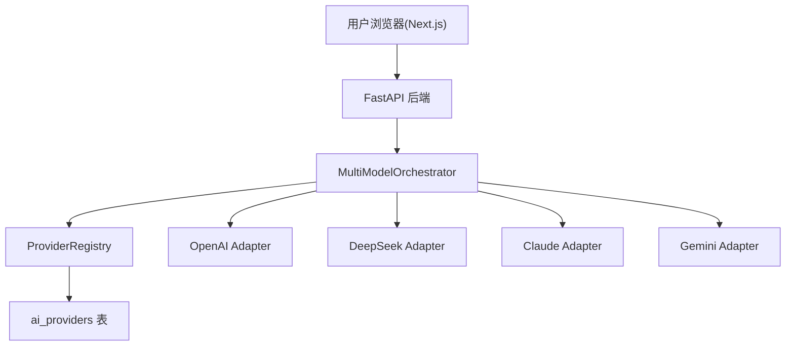

# 多模型阅卷技术方案

版本: V1.0
日期: 2026-08-09
适用范围: `backend/`（FastAPI + SQLAlchemy）、`frontend/`（Next.js 15 + React 19 + TypeScript + Tailwind v4）
关联需求: 「多模型阅卷」——支持配置多个 AI Provider，单模型/多模型/默认模型评分，每个模型独立输出分数

---

## 1. 背景与目标

### 1.1 现状分析

当前系统只支持单模型评分，核心链路如下：

| 环节 | 现状 | 问题 |
| --- | --- | --- |
| Provider 配置 | `backend/app/core/config.py` 硬编码 3 个环境变量（`OPENAI_API_KEY`/`OPENAI_API_BASE`/`OPENAI_MODEL_NAME`） | 只能配一个模型，无法扩展多厂商 |
| AI 调用 | `ai_service.py`/`ai_service_simple.py` 内部直接 `AsyncOpenAI(api_key=settings.openai_*)` | 客户端与全局配置强耦合，Provider 无法解耦 |
| 评分接口 | `POST /api/v1/essays/grade-progressive`（SSE 双阶段）、`/grade`、`/grade-simple` | 全部走单一全局模型，无模型选择参数 |
| 前端 | `/app/essay/page.tsx` 提交后仅渲染单个 `GradingResult` | 无模型选择 UI、无多结果展示 |

### 1.2 改造目标

1. **可自由添加 Provider**：运行时通过管理页面/API 增删改 AI Provider（OpenAI/Claude/Gemini/DeepSeek/Qwen/自定义），无需改代码。
2. **Provider 配置解耦**：评分、题型识别等业务逻辑只面向抽象 Provider 接口，不感知具体厂商。
3. **每个模型评分互不影响**：并发独立评分，单个模型失败/超时不阻塞其他模型。
4. **支持未来新增模型**：新增模型 = 新增一行 Provider 数据（或新增一个适配器类），业务代码零改动。

### 1.3 验收标准映射

| 验收标准 | 对应设计 |
| --- | --- |
| 可自由添加 Provider | `ai_providers` 表 + `providers` CRUD API + 前端管理页（第 3、4.4、5.2 节） |
| Provider 配置解耦 | Provider 抽象层 + Registry 注册表（第 4.1、4.2 节） |
| 每个模型评分互不影响 | 多模型编排器 `asyncio.gather(return_exceptions=True)` + 按 Provider 独立建客户端（第 4.3 节） |
| 支持未来新增模型 | 适配器按 `provider_type` 注册，新增类型只需新增一个类（第 4.1 节） |

---

## 2. 总体架构

### 2.1 架构图



### 2.2 设计原则

1. **面向接口**：评分编排器只依赖 `BaseLLMProvider`，不 import 具体厂商 SDK。
2. **注册表模式**：`ProviderRegistry` 统一从数据库加载 Provider，负责缓存与失效。
3. **隔离性**：每个 Provider 独立构建 AsyncOpenAI 客户端，独立超时；并发异常相互隔离。
4. **向后兼容**：现有三个评分接口保持可用（走默认 Provider），前端未选模型时默认全用默认模型。
5. **配置驱动**：题型识别只在默认 Provider 上执行一次，结果在同一请求内复用，避免重复计费。

---

## 3. 数据模型设计

### 3.1 ai_providers 表（新增）

```sql
CREATE TABLE ai_providers (
    id             VARCHAR(36) PRIMARY KEY,
    name           VARCHAR(100) NOT NULL,   -- 显示名，如 GPT-5 / DeepSeek V3
    provider_type  VARCHAR(50) NOT NULL,    -- openai | claude | gemini | deepseek | qwen | custom
    base_url       VARCHAR(500) NULL,       -- OpenAI 兼容端点或厂商 endpoint
    api_key        TEXT NOT NULL,           -- 加密存储（见第 6 节）
    model          VARCHAR(100) NOT NULL,   -- 模型名，如 deepseek-chat / gpt-5
    is_default     BOOLEAN DEFAULT FALSE,   -- 默认模型（单选）
    is_enabled     BOOLEAN DEFAULT TRUE,    -- 是否对用户可见可选
    timeout        INTEGER DEFAULT 180,     -- 请求超时（秒）
    extra          JSON NULL,               -- { temperature, max_tokens, capabilities, headers }
    created_at     TIMESTAMP DEFAULT NOW(),
    updated_at     TIMESTAMP DEFAULT NOW()
);
```

字段约定：

- `provider_type` 与适配器注册表一一对应（见 4.1），`custom` 表示 OpenAI 兼容的自定义网关（OpenAI 支持自定义 base）。
- `is_default` 同一时刻仅允许一个为 `true`，由管理 API 保证互斥。
- `extra.capabilities` 记录 `supports_reasoning`（推理模型）等能力位，供适配器判断解析方式。

### 3.2 history 表扩展

复用现有 `history` 表，新增 `kind = "grade_multi"`。`response_json` 存储结构化多模型结果（见 4.5），历史列表页可按 kind 展示多模型条目。

```json
{
  "results": [ ... 每个模型一条，结构见 4.5 ... ],
  "aggregate": { "avgScore": 82.3, "maxScore": 84, "minScore": 81, "diff": 3 }
}
```

### 3.3 建表与种子数据

- 启动时 `Base.metadata.create_all()` 自动建表（与现有 `history` 表一致的做法）。
- 首次启动若表为空，将 `config.py` 中的环境变量作为默认 Provider 种子写入，保证老用户无缝升级。

---

## 4. 后端设计

### 4.1 Provider 抽象层

新增目录 `backend/app/services/providers/`：

```
providers/
  __init__.py        # 导出 ProviderRegistry
  base.py            # BaseLLMProvider 抽象基类
  openai_compat.py   # OpenAI / DeepSeek / Qwen / custom（OpenAI 兼容协议）
  anthropic.py       # Claude 原生 SDK 适配器（或兼容端点 + 额外头）
  gemini.py          # Gemini 原生 SDK 适配器（或兼容端点）
  registry.py        # ProviderRegistry：从 DB 加载、缓存、失效、按 id/默认获取
```

`BaseLLMProvider` 抽象接口（核心方法）：

```python
class BaseLLMProvider(ABC):
    id: str
    name: str
    provider_type: str
    model: str
    base_url: Optional[str]

    @abstractmethod
    async def chat(self, messages, *, temperature, max_tokens, timeout) -> str:
        """单次对话，返回文本内容；推理模型在此统一取 content / reasoning_content"""

    def supports_reasoning(self) -> bool:
        return False
```

要点：

- 5 个目标厂商均提供 OpenAI 兼容端点，`openai_compat.py` 可覆盖 OpenAI/DeepSeek/Qwen/custom；Claude/Gemini 若厂商原生端点更稳则单独写适配器，注册表按 `provider_type` 分发。
- 所有现有解析/清理逻辑（`parse_ai_json_response`、`clean_ai_thinking_patterns`、`convert_diagnosis_to_score_details` 等）与厂商无关，下沉为公共工具，适配器复用。
- 新增模型：写一个继承 `BaseLLMProvider` 的类并在注册表 `register()`，或直接新增一行 `provider_type='custom'` 的数据库记录即可。

### 4.2 ProviderRegistry

```python
class ProviderRegistry:
    def list_enabled(self) -> list[BaseLLMProvider]      # 前端模型选择框数据源
    def get(self, provider_id: str) -> BaseLLMProvider
    def get_default(self) -> BaseLLMProvider              # 未选模型时的兜底
    def invalidate(self) -> None                          # CRUD 后调用，清缓存
```

- 进程内缓存 + `asyncio.Lock` 防并发重建；Provider 增删改/启停后调用 `invalidate()`。
- 校验：`provider_ids` 传入前逐一 `get()` 校验存在性，非法 id 返回 400。

### 4.3 多模型评分编排器

新增 `backend/app/services/grading/orchestrator.py`，重构现有 `grade_essay_with_expert_diagnosis` 为：

```python
async def grade_essay_with_provider(provider, essay_content, question_type) -> dict
```

编排器核心流程：

```python
async def grade_multi(content, question_type, provider_ids):
    providers = [registry.get(pid) for pid in provider_ids]       # 校验
    if not question_type:
        question_type = await detect_question_type(content)        # 默认模型一次识别
    tasks = [grade_essay_with_provider(p, content, question_type)
             for p in providers]
    results = await asyncio.gather(*tasks, return_exceptions=True) # 互不影响
    # 逐个归一化为统一 result 结构，异常 → status="error"
    return normalize(results) + build_aggregate(results)
```

隔离性保证：

- `asyncio.gather(return_exceptions=True)`：一个 Provider 抛错只标记该条 `status=error`，其他结果正常返回。
- 每个 Provider 独立客户端与超时；必要时用 `asyncio.wait(..., timeout=...)` 对单个任务做硬超时兜底。
- 并发上限用信号量控制（如最多同时 4 个），防止瞬时打爆厂商 API。

### 4.4 评分接口设计

#### 4.4.1 多模型评分（SSE 流式）

`POST /api/v1/essays/grade-multi`

请求体：

```json
{
  "content": "【题目材料与题干】...\n\n【我的作答】...",
  "question_type": "综合分析题",
  "provider_ids": ["<openai-id>", "<deepseek-id>", "<claude-id>"]
}
```

响应为 SSE 事件流（沿用 `text/event-stream`），事件类型：

| 事件 | data 结构 | 说明 |
| --- | --- | --- |
| `models_started` | `{ providerIds: [], questionType, questionTypeSource }` | 已确认并发的模型清单 |
| `model_start` | `{ provider: {id,name,type,model}, progress: 0 }` | 单个模型开始 |
| `model_progress` | `{ provider, progress: 50 }` | 单个模型阶段一完成 |
| `model_result` | `{ provider, status: "success", score, feedback, suggestions, scoreDetails, finalComments }` | 单个模型完整结果 |
| `model_error` | `{ provider, status: "error", message }` | 单个模型失败（不影响其他） |
| `done` | `{ results: [...], aggregate: {...} }` | 全部完成 + 汇总对比 |

`provider_ids` 为空时后端用 `get_default()` 兜底，等价单模型模式。

#### 4.4.2 Provider 管理 CRUD

`/api/v1/providers`

| 方法 | 路径 | 说明 |
| --- | --- | --- |
| GET | `/api/v1/providers` | 列表（`api_key` 脱敏为 `sk-***last4`） |
| POST | `/api/v1/providers` | 新增 |
| PUT | `/api/v1/providers/{id}` | 修改 |
| DELETE | `/api/v1/providers/{id}` | 删除（默认 Provider 不允许删除） |
| POST | `/api/v1/providers/{id}/test` | 连通性测试（轻量请求验证 key/model 可用） |

所有变更操作完成后调用 `registry.invalidate()`，并保证 `is_default` 互斥（事务内先清后设）。

#### 4.4.3 现有接口保持

`/grade`、`/grade-progressive`、`/grade-simple`、`/ai-status` 不变，内部改为调用 `registry.get_default()` 获取客户端，行为与之前一致。

### 4.5 统一结果结构

单模型结果（`model_result`/`done.results[]` 中每项）：

```json
{
  "provider": { "id": "p_1", "name": "GPT-5", "type": "openai", "model": "gpt-5" },
  "status": "success",
  "score": 82.0,
  "feedback": "整体评价...",
  "suggestions": ["..."],
  "scoreDetails": [
    { "item": "审题拆解", "fullScore": 25, "actualScore": 21, "description": "..." }
  ],
  "finalComments": "..."
}
```

汇总对比（`aggregate`）：

```json
{
  "avgScore": 82.3,
  "maxScore": 84,
  "minScore": 81,
  "stdDev": 1.25,
  "diff": 3,
  "rankings": [
    { "providerId": "...", "name": "Claude", "score": 84 },
    { "providerId": "...", "name": "DeepSeek", "score": 81 }
  ]
}
```

---

## 5. 前端设计

### 5.1 阅卷模型选择（`/app/essay/page.tsx`）

- 新增「阅卷模型」选择面板：加载 `GET /api/v1/providers`，对 `is_enabled` 的 Provider 渲染复选框。
- 提供「全选」开关；默认勾选 `is_default` 的 Provider。
- 提交时把选中的 `provider_ids` 随请求体发送。
- 未选任何模型时后端兜底默认模型。

交互示意：

```text
阅卷模型
[全选]
☑ GPT-5 (默认)
☐ Claude
☐ Gemini
☑ DeepSeek V3
☐ Qwen
```

### 5.2 结果展示（逐模型卡片 + 汇总对比）

- 顶部「汇总对比」卡片：展示平均分 / 最高分 / 最低分 / 分差，以及按分数降序的模型榜单（`rankings`）。
- 下方每个模型独立一张卡片：
  - 头部：模型名 + 模型标识 Badge + 状态（成功分数 / 失败提示）。
  - 分数区：大号分数 + `ScoreBar`（复用现有组件）。
  - 评分细则、详细反馈、改进建议：复用现有 `Disclosure` 折叠区与表格/移动端卡片渲染逻辑。
- 失败模型单独显示「该模型评分失败」占位卡片，不阻塞其他模型结果展示。

### 5.3 Provider 管理页（新增 `/app/admin/providers/page.tsx`）

- 表格：名称、类型、模型、Base URL、默认、启用、操作。
- 弹窗表单：name / provider_type（下拉）/ base_url / api_key（空则保留旧值）/ model / is_default / is_enabled / timeout。
- 操作：新增、编辑、删除、测试连接。
- `api_key` 只在创建/编辑时提交，列表与详情统一脱敏。

### 5.4 类型与 API 层

- 新增 `frontend/src/types/provider.ts` 与 `frontend/src/types/grading.ts`（Provider、MultiGradingResult、Aggregate 类型）。
- `src/config/api.ts` 不变；SSE 解析逻辑抽成公共 hook `useGradeMulti`，按事件类型分发到各模型卡片 state。

---

## 6. 安全设计

1. **API Key 脱敏**：管理列表/详情永不返回完整 key，仅 `sk-***<last4>`；日志禁止打印 key。
2. **存储加密**（可选增强）：`api_key` 建议使用 `cryptography` Fernet 对称加密后落库，密钥走环境变量；MVP 可先明文 + 数据库权限约束，但接口必须脱敏。
3. **默认 Provider 保护**：不允许删除 `is_default` 的 Provider，避免系统无兜底模型。
4. **SSE 失败隔离**：错误信息仅包含可读 message，不透出内部异常堆栈。

---

## 7. 兼容性与迁移

| 场景 | 处理方式 |
| --- | --- |
| 老配置（env） | 首次启动种子写入默认 Provider，行为不变 |
| 老接口调用方 | `/grade`、`/grade-progressive`、`/grade-simple` 返回结构不变 |
| 前端历史记录 | `history` 表新增 kind 值，老数据不受影响 |
| 数据库迁移 | 无迁移工具，用 `create_all` 建新表即可（与现有做法一致） |

---

## 8. 测试方案

### 8.1 单元测试

- `ProviderRegistry`：加载、缓存、invalidate、默认 Provider 互斥。
- `openai_compat` 适配器：用 mock client 验证消息构建、reasoning_content 取值、超时。
- 编排器：3 个 mock Provider 中 1 个抛错 → 结果含 2 success + 1 error，aggregate 只统计成功项。

### 8.2 手动验收清单

1. 管理页新增 OpenAI/DeepSeek/Claude/Gemini/Qwen 各一个 → 模型选择框出现 5 个。
2. 全选提交 → SSE 依次收到 `model_result` x N，最后 `done` 含汇总。
3. 故意配错一个 key → 该模型 `status=error` 占位，其余 4 个正常出分。
4. 只勾选一个 → 等价单模型，返回结构兼容。
5. 不勾选 → 走默认模型。
6. 删除默认 Provider 被拒绝；改默认后互斥生效。

---

## 9. 实施计划

| 里程碑 | 内容 | 涉及模块 |
| --- | --- | --- |
| M1 | `ai_providers` 表 + Model/Schema + 种子数据 | `models/provider.py`、`schemas/provider.py` |
| M2 | Provider 抽象层 + Registry + 适配器 | `services/providers/` |
| M3 | 重构 `grade_essay_with_provider`，抽出公共工具 | `services/ai_service.py`、`grading/` |
| M4 | `grade-multi` SSE + 汇总 + history | `api/endpoints/essay.py` |
| M5 | Provider CRUD API + 管理页 | `api/endpoints/providers.py`、`app/admin/providers` |
| M6 | 前端模型选择 + 多模型结果卡片 | `app/essay/page.tsx`、`types/` |
| M7 | 单元测试 + 验收清单 | 全链路 |

---

## 10. 附：关键文件变更清单

| 文件 | 变更 |
| --- | --- |
| `backend/app/core/config.py` | 保留 env 作为种子来源；新增默认 Provider 访问入口 |
| `backend/app/models/provider.py` | 新增 `AiProvider` |
| `backend/app/schemas/provider.py` | 新增 Provider CRUD Schema |
| `backend/app/services/providers/*` | 新增抽象层与适配器 |
| `backend/app/services/grading/orchestrator.py` | 新增多模型编排器 |
| `backend/app/services/ai_service.py` | 改为接收 Provider 参数 |
| `backend/app/api/endpoints/providers.py` | 新增 CRUD + test 接口 |
| `backend/app/api/endpoints/essay.py` | 新增 `grade-multi`；现有接口改用默认 Provider |
| `frontend/src/app/essay/page.tsx` | 模型选择 + 多模型结果渲染 |
| `frontend/src/app/admin/providers/page.tsx` | 新增管理页 |
| `frontend/src/types/*` | 新增 Provider / 多模型结果类型 |
