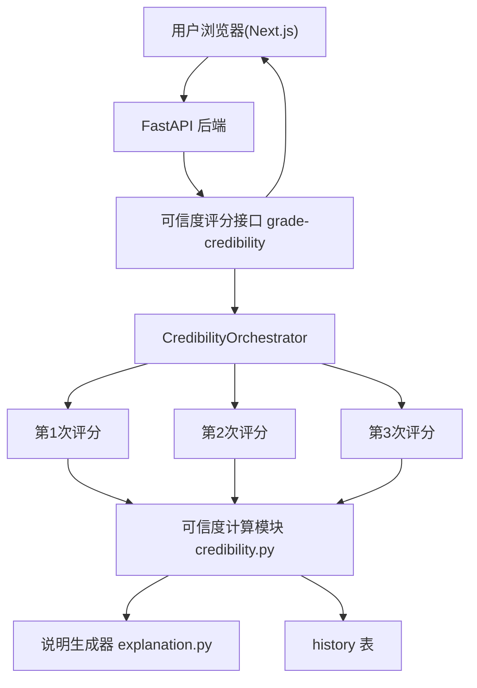

# 评分可信度技术方案

版本: V1.0
日期: 2026-08-15
适用范围: `backend/`（FastAPI + SQLAlchemy + Provider 抽象层）、`frontend/`（Next.js 15 + React 19 + TypeScript + Tailwind v4）
关联需求: 「评分可信度」——同一篇作文连续评分三次，依据分数离散程度展示可信度星级并给出说明

---

## 1. 背景与目标

### 1.1 需求描述

同一篇作文连续评分三次后，根据三次分数的一致性展示「可信度」：

| 三次分数 | 可信度展示 | 说明 |
| --- | --- | --- |
| 81 / 80 / 82 | ★★★★★ | 高度一致，评分稳定 |
| 73 / 86 / 79 | ★★☆☆☆ | 波动明显，提示 Prompt 不稳定 |

### 1.2 现状分析

当前系统评分链路如下：

| 环节 | 现状 | 与本需求的关系 |
| --- | --- | --- |
| 单模型评分 | `POST /api/v1/essays/grade-progressive`（SSE 双阶段）、`/grade`、`/grade-simple` | 都是「一次输入一次评分」，没有重复评分能力 |
| 多模型评分 | `POST /api/v1/essays/grade-multi`（SSE），多个不同模型各评一次 | 维度是「跨模型对比」，本需求是「同模型重复采样」 |
| 汇总统计 | `build_aggregate()` 已实现 mean / max / min / stdDev / diff / rankings | 统计能力可复用，但无星级映射与说明生成 |
| 历史记录 | `history` 表以 `kind` 区分，`response_json` 存结构化结果 | 新增 `kind` 值即可扩展 |
| Prompt 库 | 模板库 + 版本管理 + 发布即生效 | 可为「可信度说明」新增 AI 模板（可选增强） |

### 1.3 改造目标

1. **重复评分**：同一作文、同一 Prompt 链路，连续执行 N 次（默认 3 次）评分，N 可配置。
2. **可信度计算**：基于三次分数计算 0~100 可信度分，并映射为 1~5 星，映射规则可配置。
3. **说明生成**：根据星级与统计指标生成可读说明，命中「Prompt 不稳定」等风险提示。
4. **展示升级**：前端展示三次分数、统计指标、星级与说明，进度与现有 SSE 体验一致。
5. **可观测与审计**：结果写入 `history`，`kind = "grade_credibility"`，便于回看与效果评估。

### 1.4 验收标准映射

| 验收标准 | 对应设计 |
| --- | --- |
| 81/80/82 → ★★★★★ | 可信度算法（第 4 节） |
| 73/86/79 → ★★☆☆☆ | 可信度算法（第 4 节） |
| 显示「说明：Prompt 不稳定」等提示 | 说明生成器（第 4.4 节、第 5 节） |
| 同一篇作文连续评分三次 | 重复评分编排器（第 5.3 节） |

---

## 2. 总体设计

### 2.1 架构图



### 2.2 设计原则

1. **复用现有评分能力**：每次评分直接复用 `grade_essay_with_provider`（单模型双阶段评分），不改动评分 Prompt 链路本身。
2. **同 Prompt 重复采样**：三次评分使用相同的 provider、相同的题型识别结果、相同的 Prompt，从而真实暴露「同 Prompt 下的模型随机性 / 稳定性」。
3. **计算与展示解耦**：可信度计算（星级、分数、说明）是纯函数，可单测；接口层只负责编排与落库。
4. **阈值可配置**：星级映射阈值、评分轮数、并发数均通过配置项控制，便于调参而不改代码。
5. **向后兼容**：现有所有接口与前端行为不变，新功能为增量新增。

---

## 3. 数据模型设计

### 3.1 history 表扩展（无新增表）

复用现有 `history` 表，新增 `kind = "grade_credibility"`。`response_json` 结构：

```json
{
  "rounds": 3,
  "scores": [81, 80, 82],
  "statistics": {
    "mean": 81.0,
    "min": 80.0,
    "max": 82.0,
    "range": 2.0,
    "stdDev": 0.82
  },
  "credibilityScore": 90.0,
  "stars": 5,
  "level": "高度可信",
  "explanation": "三次评分高度一致（81/80/82 分），评分稳定，可信度高。",
  "riskNote": "",
  "failedRounds": []
}
```

- 若部分轮次失败：`scores` 只含成功轮次，`failedRounds` 记录失败索引与原因；成功轮次 < 2 时 `credibilityScore = null`、`stars = 0`、`level = "无法评估"`。
- 不新增数据库表，避免迁移复杂度（与现有做法一致，`create_all` 即可覆盖）。

### 3.2 配置项（新增 `backend/app/core/config.py`）

| 配置 | 默认值 | 说明 |
| --- | --- | --- |
| `CREDIBILITY_ROUNDS` | 3 | 默认评分轮数（2~5） |
| `CREDIBILITY_CONCURRENCY` | 1 | 并发轮数，1=连续串行（贴合「连续评分三次」） |
| `CREDIBILITY_RANGE_PENALTY` | 5.0 | 每 1 分极差扣减的可信度分 |
| `CREDIBILITY_STAR_THRESHOLDS` | `[85, 70, 55, 35]` | 5/4/3/2 星的最低可信度分 |

---

## 4. 可信度算法设计（核心）

### 4.1 输入

`rounds` 个成功评分的分数列表 `scores = [s1, s2, ...]`，分数取值域 0~100。

### 4.2 统计指标

```
mean   = mean(scores)            # 均分
min    = min(scores)
max    = max(scores)
range  = max - min               # 极差（主要指标）
stdDev = population stddev       # 总体标准差（辅助展示）
```

### 4.3 可信度分与星级映射

```
credibilityScore = max(0, 100 - RANGE_PENALTY * range)
```

默认 `RANGE_PENALTY = 5.0`，星级映射（`STAR_THRESHOLDS = [85, 70, 55, 35]`）：

| 可信度分 | 星级 | 等级 | 分差（等价表述） |
| --- | --- | --- | --- |
| >= 85 | ★★★★★ | 高度可信 | range <= 3 |
| >= 70 | ★★★★☆ | 较为可信 | range 4~6 |
| >= 55 | ★★★☆☆ | 一般可信 | range 7~9 |
| >= 35 | ★★☆☆☆ | 可信度较低 | range 10~13 |
| < 35 | ★☆☆☆☆ | 不可信 | range >= 14 |

### 4.4 示例验证

| 分数 | mean | range | stdDev | credibilityScore | 星级 | 说明 |
| --- | --- | --- | --- | --- | --- | --- |
| [81, 80, 82] | 81.0 | 2 | 0.82 | 100 - 5×2 = **90** | **★★★★★** | 高度一致 |
| [73, 86, 79] | 79.33 | 13 | 5.31 | 100 - 5×13 = **35** | **★★☆☆☆** | 波动明显 |

两组示例均精确命中需求结果。

### 4.5 边界情况

| 场景 | 处理 |
| --- | --- |
| 三次完全一致（如 [80,80,80]） | range=0 → credibility=100 → ★★★★★ |
| 仅 2 次成功 | 仍计算（range = 差值）；并提示「部分轮次失败，结果仅供参考」 |
| 成功轮次 < 2 | 无法评估，`stars = 0`，说明为「有效评分不足，无法评估可信度」 |
| 分数含小数 | 正常参与统计，`range` 允许小数 |
| 极差极大（如 [40,90,60]） | credibility 被 clamp 到 0，显示 ★☆☆☆☆ |

### 4.6 说明生成器

基于星级与统计指标生成两类说明：

**星级文案（`level` + 短说明）**

| 星级 | 说明模板 |
| --- | --- |
| 5 | 「三次评分高度一致（{scores} 分），评分稳定，可信度高。」 |
| 4 | 「三次评分较为接近（{scores} 分），评分基本稳定，可信度良好。」 |
| 3 | 「三次评分存在一定波动（{scores} 分），建议结合多模型阅卷综合判断。」 |
| 2 | 「三次评分波动明显（{scores} 分），当前 Prompt 的评分不稳定，建议调整 Prompt 或更换模型后重新评分。」 |
| 1 | 「三次评分严重不一致（{scores} 分），当前评分不可信，请调整 Prompt / 模型后重试。」 |

**风险提示（`riskNote`）**

- 星级 <= 3 且 `stdDev >= 3.0`：`riskNote = "Prompt 不稳定"`（直接命中需求示例的「说明：Prompt 不稳定」）。
- 星级 == 1：追加建议「建议降低评分 Prompt 的模糊性，或改用多模型交叉阅卷」。

**AI 增强说明（可选，V1.1）**：新增 Prompt 库模板 `credibility_explanation`（分类「可信度」），将统计指标 JSON 注入模板，由 AI 生成更细粒度诊断；未发布模板时自动回退到规则生成，保证链路不断。

---

## 5. 后端设计

### 5.1 新增模块

```
backend/app/services/credibility/
  __init__.py
  compute.py        # 统计指标 + credibilityScore + stars 映射（纯函数）
  explanation.py    # level / explanation / riskNote 规则生成
  orchestrator.py   # 重复评分编排：N 次并发/串行执行 grade_essay_with_provider
```

### 5.2 可信度计算（compute.py，纯函数，可单测）

```python
def compute_credibility(scores: list[float]) -> dict:
    """输入分数列表，输出统计指标 + credibilityScore + stars。"""
    # 见 4.2 / 4.3，返回值结构同 3.1 的 statistics/credibilityScore/stars/level
```

- `stars` 由 `STAR_THRESHOLDS` 二分查找得到，`level` 由映射表得到。

### 5.3 重复评分编排器（orchestrator.py）

```python
async def grade_credibility_stream(
    content: str,
    question_type: Optional[str],
    provider_id: Optional[str],
    rounds: int,
) -> AsyncGenerator[dict, None]:
    # 1. 解析 provider（未指定用默认，失败抛 ProviderNotFoundError）
    # 2. 识别题型一次（复用 detect_question_type，全轮复用）
    # 3. yield {"type": "runs_started", rounds, provider, questionType, questionTypeSource}
    # 4. 按 CREDIBILITY_CONCURRENCY 控制并发执行 N 次 grade_essay_with_provider
    #    - 每轮完成 yield {"type": "run_result", index, score, status, ...}
    #    - 每轮失败 yield {"type": "run_error", index, status: "error", message}
    # 5. 全部结束后 compute_credibility(成功分数) + explanation
    # 6. yield {"type": "done", rounds, scores, statistics, credibilityScore, stars, level, explanation, riskNote, failedRounds}
```

要点：

- 三次评分使用**同一个 provider 与同一个 `temperature`**（沿用 `grade_essay_with_provider` 内部 0.2 等既有设置），不额外放大随机性。
- 默认串行（`CREDIBILITY_CONCURRENCY = 1`），贴合「连续评分三次」，且避免同模型瞬时打爆限流；并发数可配置。
- 每轮失败不影响其他轮次；最终可信度只用成功轮次计算。
- 单轮复用现有 `grade_essay_with_provider`，`score = result.score`。

### 5.4 接口设计

`POST /api/v1/essays/grade-credibility`（SSE 流式，与 grade-multi 一致）

请求体：

```json
{
  "content": "【题目材料与题干】...\n\n【我的作答】...",
  "question_type": "综合分析题",
  "provider_id": "<provider-id>",
  "rounds": 3
}
```

- `provider_id` 省略时用默认 Provider。
- `rounds` 省略时用 `CREDIBILITY_ROUNDS`（默认 3），服务端 clamp 到 2~5。

SSE 事件流：

| 事件 | data 结构 | 说明 |
| --- | --- | --- |
| `runs_started` | `{ rounds, provider: {id,name,type,model}, questionType, questionTypeSource }` | 确认轮数与评分模型 |
| `run_result` | `{ index, score, status: "success", provider }` | 单轮完成（附分数） |
| `run_error` | `{ index, status: "error", message, provider }` | 单轮失败（不影响其他轮） |
| `done` | `{ rounds, scores, statistics, credibilityScore, stars, level, explanation, riskNote, failedRounds }` | 全部完成 + 可信度结论 |
| `error` | `{ message }` | 整体失败（如无可用 Provider） |

完成后写入 `history`（`kind = "grade_credibility"`，结构见 3.1），`extra_json` 存 `{"credibility_score": ...}` 便于列表页展示。

### 5.5 Schema 新增（backend/app/schemas/provider.py）

```python
class CredibilityRequest(BaseModel):
    content: str = Field(..., min_length=1)
    question_type: Optional[str] = Field(None)
    provider_id: Optional[str] = Field(None)
    rounds: Optional[int] = Field(None, ge=2, le=5)
```

---

## 6. 前端设计

### 6.1 入口（`/app/essay/page.tsx`）

在现有「双角色批改 / 多模型阅卷」模式 Tab 中新增第三种模式「**可信度检验**」：

- 复用左侧现有「题目材料」「我的作答」输入区。
- 多模型模式中已有的「阅卷模型选择」改为：可信度模式下展示为**单选**模型下拉（`provider_id`），默认默认模型。
- 提交调用新 hook `useGradeCredibility`。

### 6.2 新增 hook（frontend/src/hooks/useGradeCredibility.ts）

- 复用 `useGradeMulti` 的 SSE 解析骨架，订阅 `runs_started / run_result / run_error / done / error`。
- state：`rounds`、`results[]`（每轮分数）、`credibility`（credibilityScore/stars/level/explanation/riskNote）、`statistics`、`isStreaming`、`error`、`statusText`。

### 6.3 结果展示组件（frontend/src/components/CredibilityResultView.tsx）

- **星级横幅**：`★★★★★`（实心/空心星按 `stars` 渲染，`stars = 0` 时显示「无法评估」），下方展示 `level` 与 `credibilityScore`。
- **三次分数区**：横向三张分数卡（第1次 / 第2次 / 第3次），复用 `ScoreBar` 组件；失败的轮次显示失败占位。
- **统计区**：均分 / 最低 / 最高 / 极差 / 标准差。
- **说明区**：`explanation` 文案；`riskNote = "Prompt 不稳定"` 时以醒目样式（如琥珀色 Badge）突出显示「说明：Prompt 不稳定」。
- 骨架屏与进度条样式复用现有多模型模式。

### 6.4 类型与常量（frontend/src/types/grading.ts）

```ts
export interface CredibilityStatistics {
  mean: number; min: number; max: number; range: number; stdDev: number;
}
export interface CredibilityResult {
  rounds: number;
  scores: number[];
  statistics: CredibilityStatistics;
  credibilityScore: number | null;
  stars: number;
  level: string;
  explanation: string;
  riskNote: string;
  failedRounds: { index: number; message: string }[];
}
```

新增事件类型：`RunsStartedEvent`、`RunResultEvent`、`RunErrorEvent`、`CredibilityDoneEvent`。

---

## 7. 兼容性与迁移

| 场景 | 处理方式 |
| --- | --- |
| 老接口调用方 | `/grade`、`/grade-progressive`、`/grade-multi` 等均不变 |
| 前端历史记录 | `history` 新增 `kind` 值，老数据不受影响 |
| 数据库迁移 | 无新增表，`create_all` 即可，无需迁移脚本 |
| 无可用 Provider | 返回 `error` 事件，前端显示兜底提示（与多模型模式一致） |

---

## 8. 测试方案

### 8.1 单元测试（backend/tests/test_credibility.py）

| 用例 | 输入 | 期望 |
| --- | --- | --- |
| 高度一致 | [81, 80, 82] | stars=5，credibilityScore=90 |
| 需求示例 | [73, 86, 79] | stars=2，credibilityScore=35 |
| 完全一致 | [80, 80, 80] | stars=5，score=100 |
| 极限波动 | [40, 90, 60] | stars=1，score clamp 至 0 |
| 仅 2 次成功 | [80, 86] | 正常计算，failedRounds 非空 |
| 1 次成功 | [80] | 无法评估，stars=0 |
| 空列表 | [] | 无法评估，stars=0 |
| 阈值边界 | range=3 / 4 / 6 / 7 / 9 / 10 / 12 / 13 | 分别命中 5/4/4/3/3/2/2/1 星 |
| 说明生成 | stars<=3 且 stdDev>=3 | riskNote 包含「Prompt 不稳定」 |

### 8.2 编排器测试（mock Provider）

- mock Provider 第 2 轮抛错 → `run_result` ×2 + `run_error` ×1，`done` 用成功分数计算。
- 并发参数为 1 时按顺序产出；并发为 3 时全部产出。
- `provider_id` 非法 → 整体 `error` 事件。

### 8.3 手动验收清单

1. 提交同一篇作文，勾选「可信度检验」→ 依次收到 3 个 `run_result`，最后 `done` 含星级与说明。
2. 三次分数相近（如 81/80/82）→ 显示 ★★★★★、「高度可信」。
3. 三次分数分散（如 73/86/79）→ 显示 ★★☆☆☆、「可信度较低」、醒目「说明：Prompt 不稳定」。
4. 断网/改错 key → 部分轮失败有占位，成功轮数不足时显示「无法评估」。
5. 历史列表出现 `grade_credibility` 条目，可查看完整可信度结果。

---

## 9. 实施计划

| 里程碑 | 内容 | 涉及模块 |
| --- | --- | --- |
| M1 | `credibility/compute.py` + `explanation.py` 纯函数 + 配置项 | `core/config.py`、`services/credibility/` |
| M2 | `credibility/orchestrator.py` + Schema + SSE 接口 | `api/endpoints/essay.py`、`schemas/provider.py` |
| M3 | 历史记录落库（`kind=grade_credibility`） | `services/history_service.py` |
| M4 | 前端 hook + 模式 Tab + 结果组件 | `hooks/useGradeCredibility.ts`、`components/CredibilityResultView.tsx`、`app/essay/page.tsx`、`types/grading.ts` |
| M5 | 单元测试 + 手动验收清单 | `tests/test_credibility.py` |

---

## 10. 附：关键文件变更清单

| 文件 | 变更 |
| --- | --- |
| `backend/app/core/config.py` | 新增可信度配置项（4 项） |
| `backend/app/services/credibility/compute.py` | 新增：统计 + 星级映射 |
| `backend/app/services/credibility/explanation.py` | 新增：level/explanation/riskNote 规则生成 |
| `backend/app/services/credibility/orchestrator.py` | 新增：重复评分编排 + SSE 事件 |
| `backend/app/schemas/provider.py` | 新增 `CredibilityRequest` |
| `backend/app/api/endpoints/essay.py` | 新增 `POST /essays/grade-credibility` |
| `backend/app/services/history_service.py` | 支持 `kind=grade_credibility`（若需） |
| `backend/tests/test_credibility.py` | 新增单元测试 |
| `frontend/src/types/grading.ts` | 新增可信度类型与事件类型 |
| `frontend/src/hooks/useGradeCredibility.ts` | 新增 SSE hook |
| `frontend/src/components/CredibilityResultView.tsx` | 新增星级 + 分数卡 + 说明展示 |
| `frontend/src/app/essay/page.tsx` | 新增「可信度检验」模式 Tab |
